# 数字图像处理

本课程是图像处理的入门课程，用案例与任务形式来驱动学生进行数字图像处理相关的学习，以满足职业教育、应用型人才的发展要求。

# 第1章 虚拟机安装与开发环境部署

# 课程目录

一、VMware虚拟机的安装

二、python+Numpy+OpenCV的安装

# 一、VMware虚拟机的安装

## 1. 虚拟机是什么？

​    虚拟机其实是一种虚拟化技术，其允许多个虚拟环境共享一个系统。通过虚拟机监控程序负责管理硬件并将物理资源与虚拟环境分隔开。来自物理环境的资源根据需要进行分区后，会灵活地分配给虚拟机使用。

​    换句话说，虚拟机就是一种能够管理一部分操作系统所需的硬件资源（如：CPU、GPU、内存、硬盘等），并将其灵活地分配给不同的操作系统的软件（如图1.1所示）。

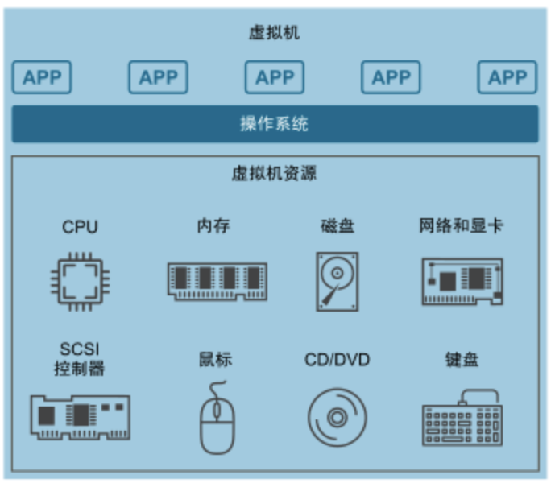

图1-1-1 虚拟机的基本原理 

## 2. 虚拟机的优势

​    虚拟机隔离、独立于系统的其余部分，而且单个计算机（如服务器）上可以有多个虚拟机。用户可以根据自己的需求在主机服务器之间移动这些虚拟机，更有效地利用资源。同时，虚拟机允许在一台计算机上同时运行多个不同的操作系统，比如一台macOS笔记本电脑上装Windows的系统。虚拟机操作系统的运行方式与通常操作系统或应用在主机硬件上使用的运行方式相同，因此，在虚拟机中获得的最终用户体验与物理机上的实时操作系统体验几乎毫无二致。

## 3. 虚拟机的安装

​    这里，我们以最主流的VMWare虚拟机为例，其他种类的虚拟机（如：Parallel Desktops和Virtual Box）请同学们自行学习。

在浏览器中打开搜索 vmware workstation, 或打开网址：https://www.vmware.com/cn/products/workstation-pro/workstation-pro-evaluation.html。单击如图1-2中的“立即下载”超链接进行下载。

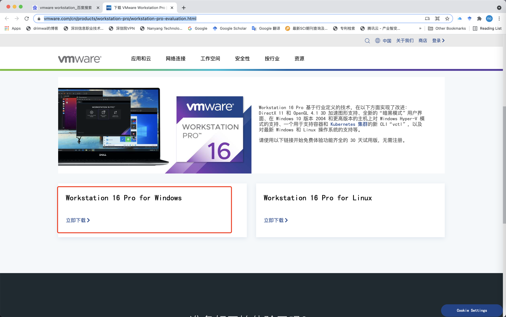

图1-1-2 虚拟机的下载 

打开网址：https://www.microsoft.com/zh-cn/software-download，选择一个想要下载的操作系统。这里以win为例。请大家务必选择语言为英语，因为使用中文的操作系统会出现各种奇怪的路径问题。或者登陆我的网盘：链接: https://pan.baidu.com/s/1T27X7BLE6FT4rA31e0t8cA 提取码: d6ql 

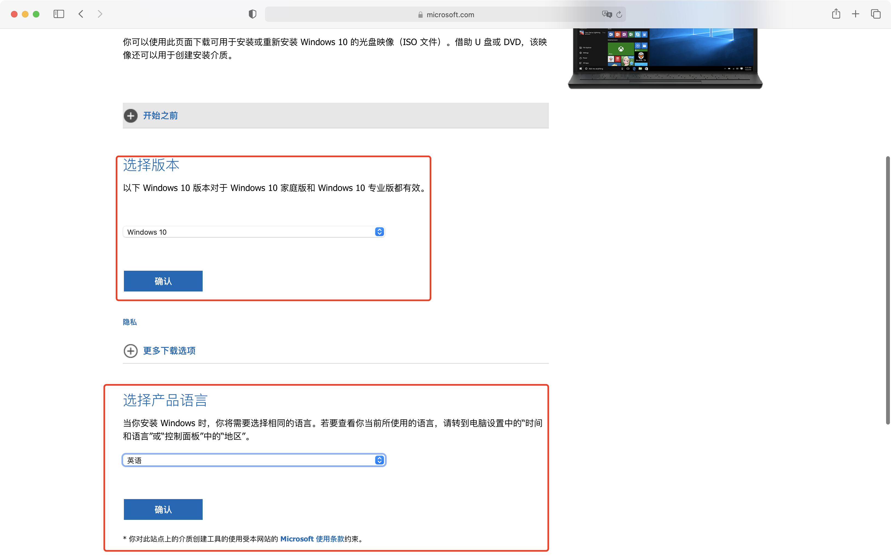

图1-1-3 操作系统的下载 

在虚拟机和镜像都下载完毕后，便可以开始部署一台虚拟机了（如图1-4所示）

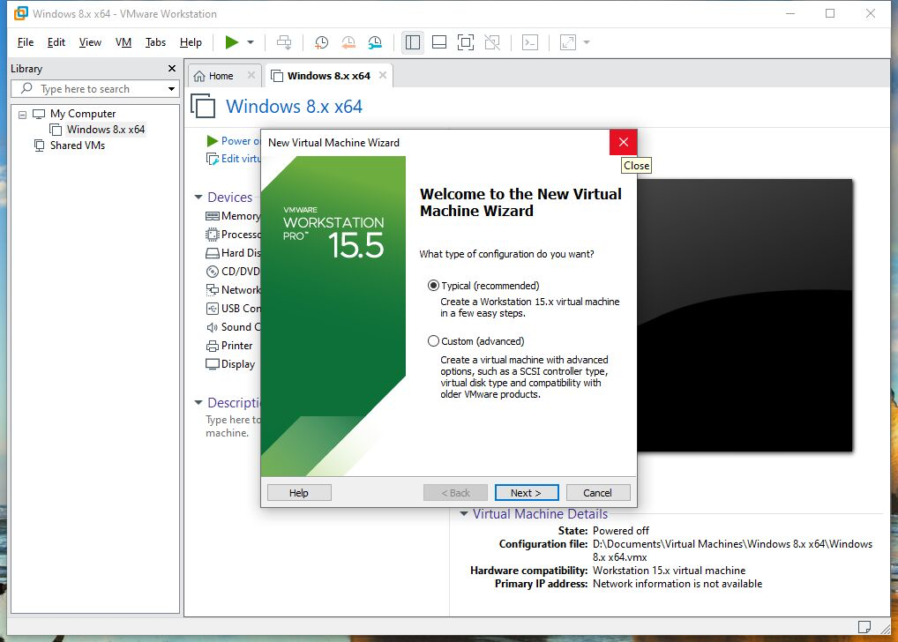

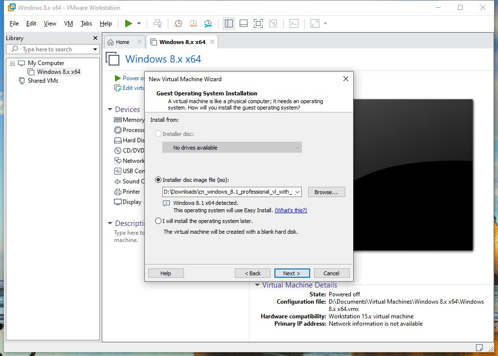

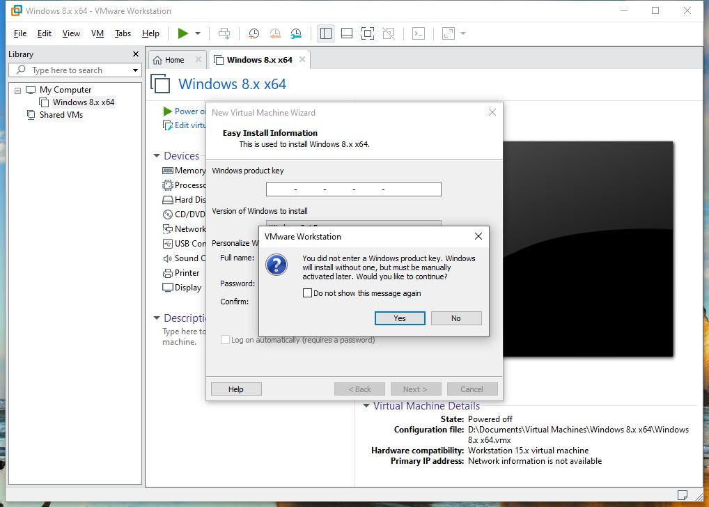

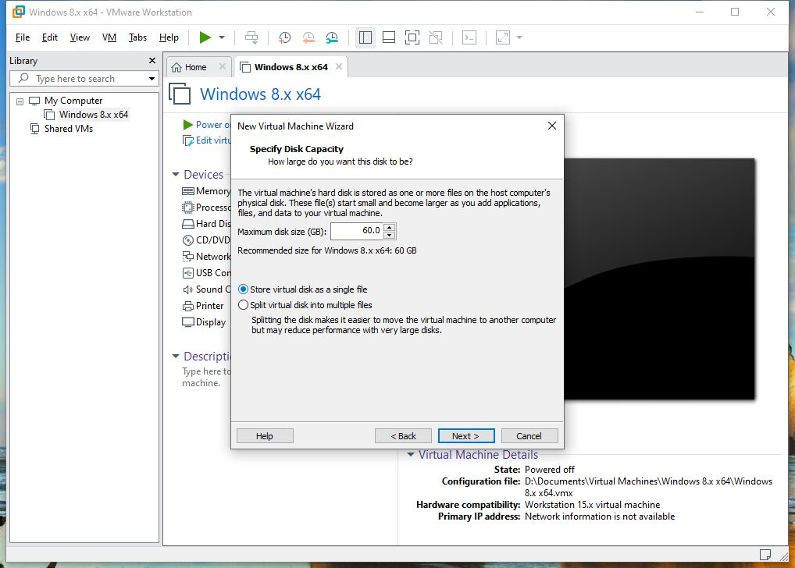

图1-1-4 虚拟机的部署 

## 4. 课后习题

1. 为什么要安装虚拟机？
2. 虚拟机与主机操作系统有什么不同？

# 二、python+Numpy+OpenCV的安装

## 1. 知识准备

### 1.1. python程序设计语言

​    Python是一门免费的、可跨平台开发的程序设计语言，被广泛应用于人工智能、科技计算与统计。Python有大量的开源科学计算库与机器学习库，可以快速实现人工智能应用。Python具备快速开发桌面应用与Web应用的能力，可以通过API(Application Programming Interface,应用程序编程接口)为第三方任意程序设计语言编写的软件程序提供人工智能服务，也可以调用第三方的API快速实现人工智能应用。业内流传着一句话：人生苦短，我用Python。

### 1.2. numpy库

​    Numpy是Python的一种开源的数值计算，提供许多矩阵运算与数值编程功能，为人工智能应用提供良好的科学计算基础。如果有线性代数、图像信号处理基础的读者可以使用Numpy来进行矩阵运算和图像运算。本节主要任务是在windows环境安装Numpy。

### 1.3. OpenCV库

​    OpenCV-Python是OpenCV在Python开发环境下的机器视觉库，不单止有计算机视觉功能，还有可应用在其他非视觉领域的机器学习功能。目前大部分机器视觉的从业人员都直奔深度学习去了，对机器视觉基础，尤其是图像处理、特征、检测与识别缺乏基本了解与掌握，在这种情况下，很难对机器视觉工程应用有较好突破。因此，掌握OpenCV及其机器视觉的基本内容对从事该领域工作有很好的帮助。

## 2. 开发环境安装步骤

打开下载地址为https://www.Python.org/downloads/windows/。选择如图1-2-1中的“Download Windows x86-64 executable installer”进行下载。

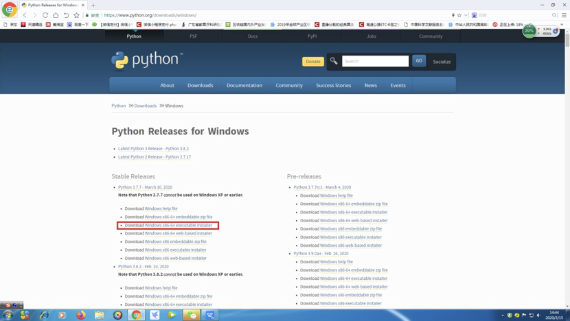

图1-2-1 Python3.X下载 

打开所下载安装文件的目录，运行Python安装包。

点击下载后的安装文件后，确保勾选的选项与如图1-2-2中一致，并点击Install按钮，按提示完成安装。

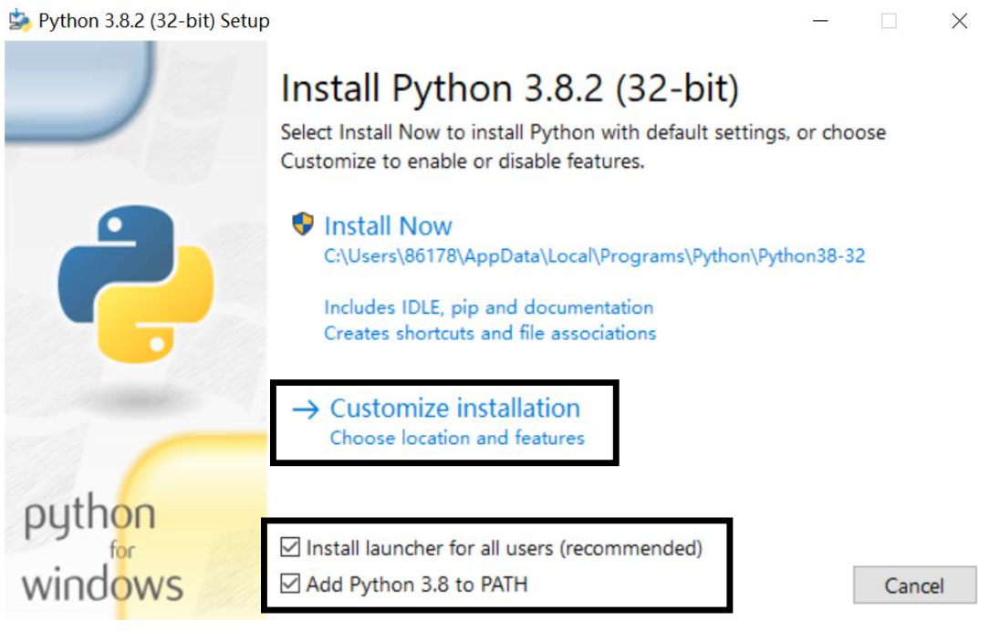

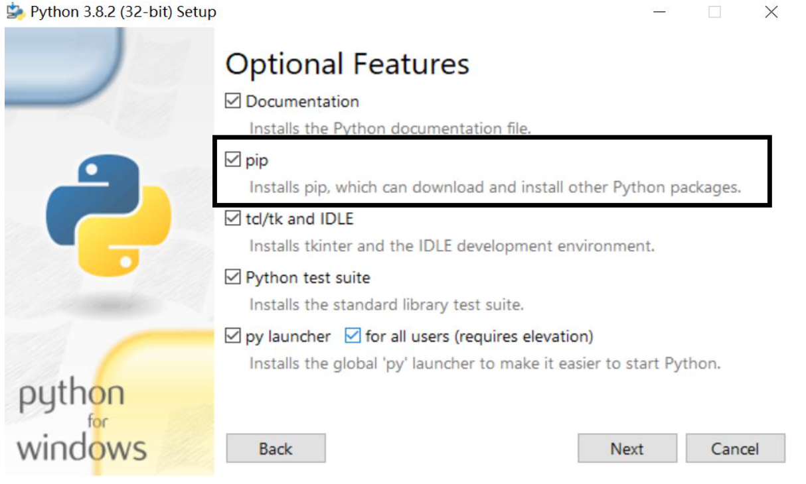

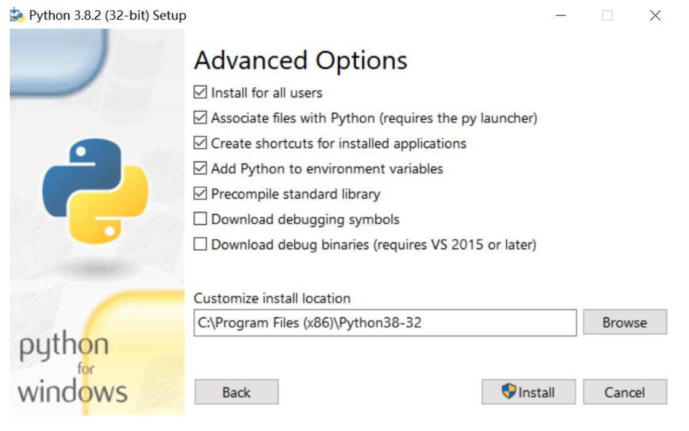

图1-2-2 Python3.X下载 

在命令窗口下，输入Python命令，返回有版本号信息，则Python安装成功，如图1-2-3所示，此时进入Python命令行开发环境。在Python命令行开发环境下，输入exit() 命令可退出该环境，如图1-2-3所示。在命令窗口中输入pip命令，返回pip的 相关信息，则pip安装成功，如图1-2-3所示。

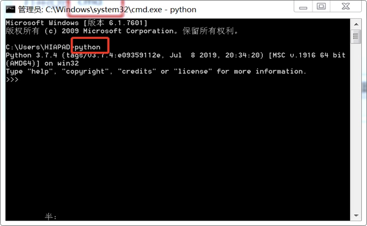

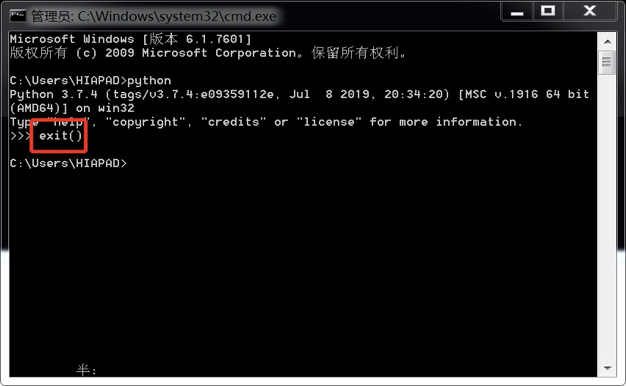

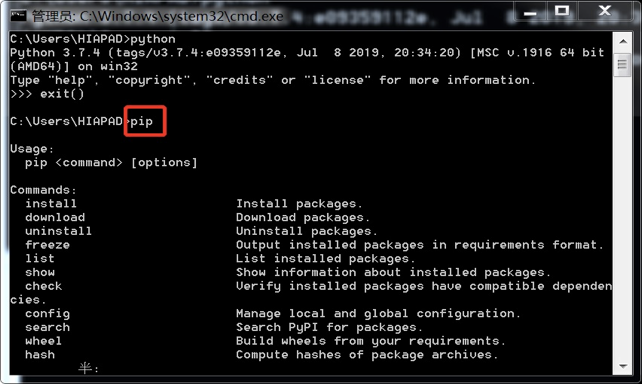

图1-2-3 验证Python是否安装成功 

打开cmd窗口，输入pip install numpy命令，会自动搜索numpy安装资源并进行安装。当pip版本过低时，会出现黄色字体警告提示，如图1-2-4所示，需要先通过 “Python -m pip install --upgrade pip”命令对pip进行升级，才能使用pip来安装其他库。

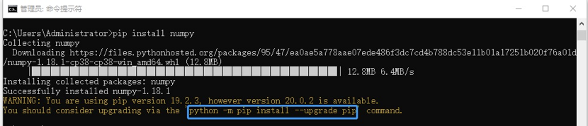

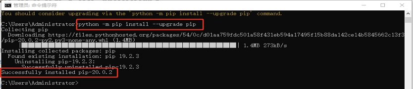

图1-2-4 安装Numpy库 

如图1-2-5所示，pip升级成功后，在cmd窗口下，输入pip install numpy，开始自动进行安装numpy，若已经安装则出现Requirement already satisfied相关字样，否则会自动获取安装。

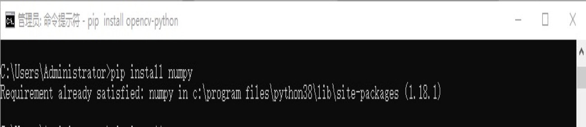

图1-2-5 Numpy库安装成功 

打开cmd窗口，输入pip install OpenCV-Python命令，会自动获取安装OpenCV。此时安装的OpenCV最新版本4.2.0.32版本

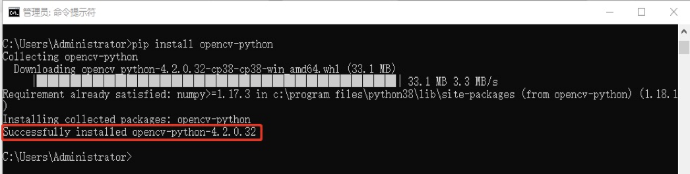

图1-2-6 OpenCV库的安装 

同时，若点击windows的"开始"，则会找到Python 3.X的IDLE工具，如图1-2-6所示。运行IDLE，则Python IDLE显示如图1-2-6所示。Python IDLE是Python的集成开发环境，可以进行命令行编程，也可以新建脚本进行编程并运行。至此，开发环境安装成功。

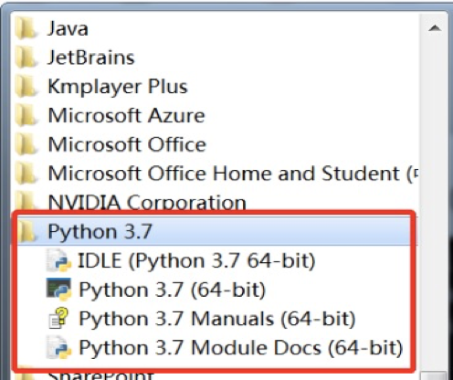

图1-2-6 图像处理开发环境 

