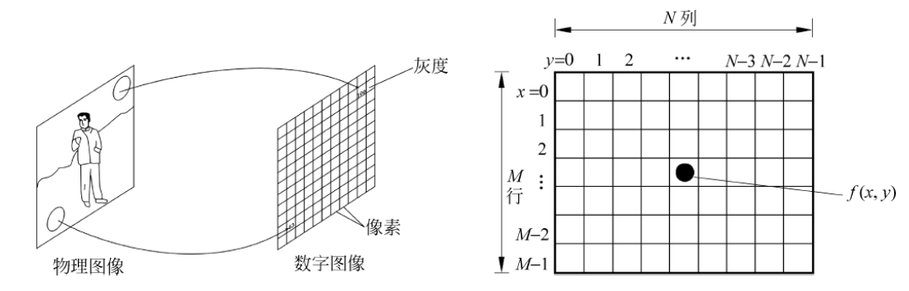
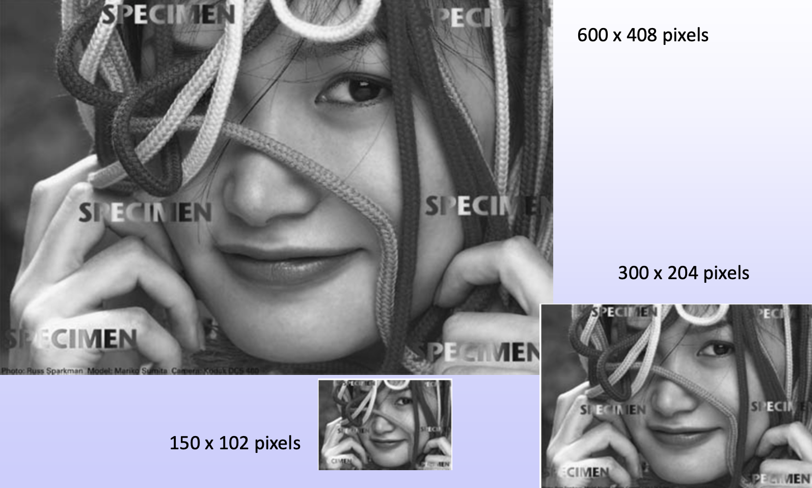
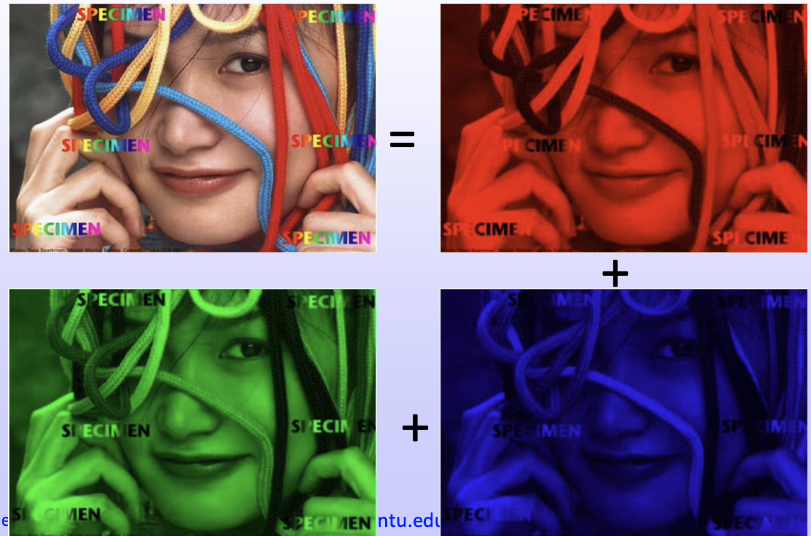
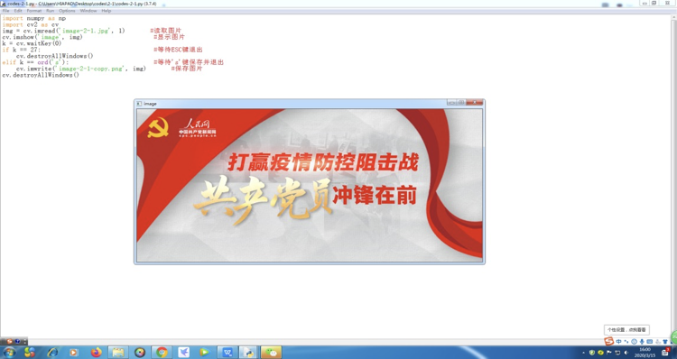
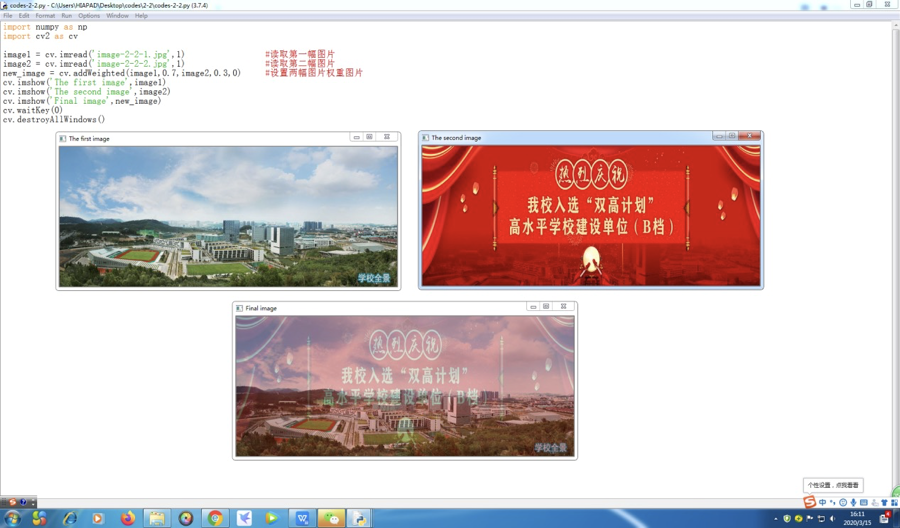
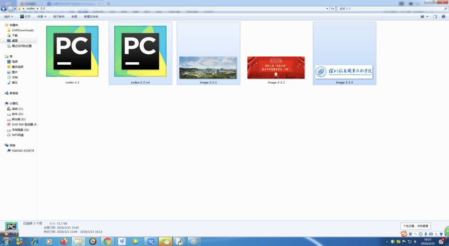
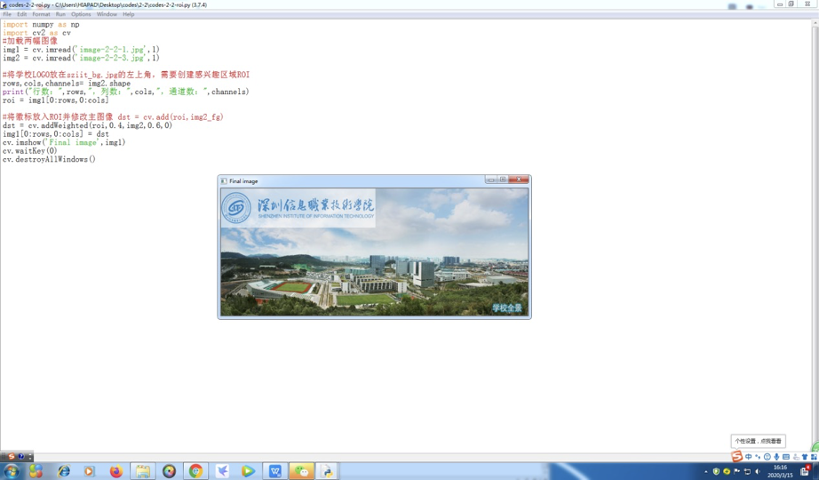
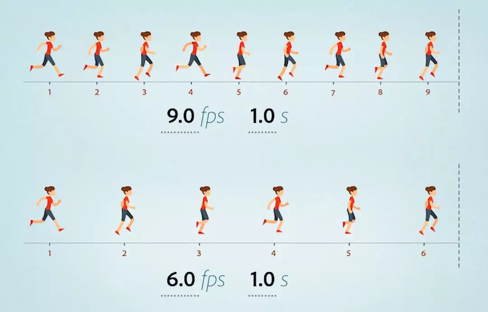
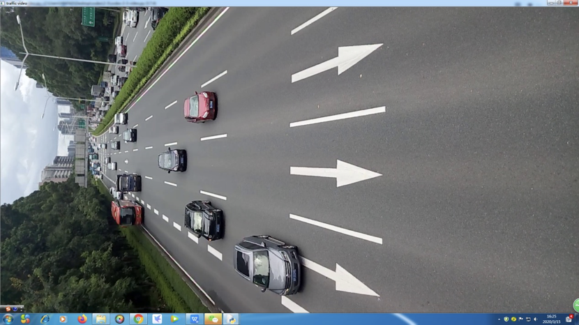

# 数字图像处理

本课程是图像处理的入门课程，用案例与任务形式来驱动读者进行数字图像处理相关的学习，以满足职业教育、应用型人才的发展要求。


# 第2章 图像/视频基本操作


# 课程目录

一、图像简介与基本操作

二、视频简介与基本操作


# 一、图像简介与基本操作

## 1. 图像的简介

​    在自然的形式下，**图像并不能直接被计算机分析与处理**。因为计算机智能处理数字而不是模拟的信息，所以一幅图像在用计算机进行处理前必须先转化为数字形式。一旦图像数字化后，后续的处理都可以直接利用计算机进行处理。图像又分为**彩色图像**与**灰度图像**，彩色图像是由三通道如RGB或HSV等颜色空间组成，灰度图像是单通道的图像。不管是单通道还是三通道，每一个像素值的每一个通道的取值范围都是0-255,0表示该通道最暗或强度最低，255表示该通道最亮或强度最高。

​    以灰度图像为例，如图2-1-1所示：



<center>图2-1-1 灰度数字图像</center>

​    上述灰度图像$f(x,y)$按等间隔采样，拍成$M\times N$矩阵，如图2-1-1所示。在该数字图像中，$M$和$N$的取值为正整数。灰度级的取值为2的整数幂，如64（$2^{6}$）或256（$2^8$）。其中，$M$和$N$的取值越大，即像素点越多或像素越高，所显示的图像也越清晰，如图2-1-2所示：



<center>图2-1-2 不同像素下的灰度图像</center>


<center>图2-1-3 不同像素下的灰度图像</center>

而不同灰度级下的图像则显示的细腻程度不一，如图2-1-3所示。

​    彩色图像则类似于灰度图像，不过其由于需要显示色彩，所以需要用3个矩阵表示（R，G，B）值，如图2-1-4所示。（三原色是一切色彩的基础色！）



<center>图2-1-4 彩色图像的数字化</center>

## 2.图像的基本操作

### 2.1. 本节任务

​    机器视觉的首要任务就是对图像进行处理与识别，首先就要能够把图像数据从文件读取，以便进行观察、分析与处理。在图像被读取之后，原图像需要显示出来供观察分析，而处理和识别结果也需要显示出来并保存。因此，为了更好地观测与分析图像，本节任务是使用Python和OpenCV开发桌面应用脚本程序对图像文件进行读取、存储与显示。 

### 2.2. 代码

​    打开Python IDLE的shell窗口，选择File->New File新建一个Python脚本，并敲入代码如下：

```python
#引入numpy和opencv库
import numpy as np
import cv2 as cv

#读取并显示图像
img = cv.imread('image-2-1.jpg', 1)
cv.imshow('image',img)

#保存图像
key = cv.waitKey(0)
if key == 27:	#27在ASCI码中代表ESC
  cv.destroyAllWindows()
elif key == ord('s'):
  cv.imwrite('image-2-1_copy.jpg',img)
cv.destroyAllWindows()
```

敲完代码后，保存在本地目录中。然后，网上下载任意一张图片，并保存在python代码相同的目录下。最后，执行对应的python代码。

### 2.3. 执行效果

​    代码被执行后，显示效果如图2-2-1所示：



<center>图2-2-1 代码执行效果</center>

在image窗口下按下S键，则该图像会以image-2-1_copy.jpg的命名和格式保存在了同一目录下，如图2-2-2所示：


<center>图2-2-2 保存图像后效果</center>

### 2.4. 习题

1. 读取图像需要用到OpenCV里的哪个函数？该函数需要传入什么参数？
2. 显示图像需要用到OpenCV里的哪个函数？该函数需要传入什么参数？
3. 保存图像需要用到OpenCV里的哪个函数？该函数需要传入什么参数？
4. 在网络上任意下载一张图像，实现图像的读取、显示与存储，存储时改变图像的名称与格式。
5. 如何对同一目录下多张图像进行批量读取、显示与保存？

## 3. 图像的叠加

### 3.1. 本节任务

​    在平面设计或广告设计领域，经常会看到两幅不同的图像能够以类似半透明的方式叠加在一起。在微信朋友圈，也经常见到同一个广告图片里包含了多个内容，例如有商品图片、二维码、个人摄影照片等内容。同时，阿里、鲁班大师能够在很短的时间内自动生成上百甚至上千张丰富多彩的广告设计图。 这些现象都或多或少利用了图像融合或图像叠加的技术。本节主要采用OpenCV里cv.addWeighted()函数对两幅图像进行叠加，主要任务包括：对两幅相同长宽的图像进行叠加；对两幅长宽不相等的图像选取感兴趣区域进行叠加，形成水印效果。

### 3.2. 图像的直接叠加代码

```python
import numpy as np
import cv2 as cv

#图像的读取
image1 = cv.imread('image-2-1.jpg',1)
image2 = cv.imread('image-2-2.jpg',1)

#图像的叠加
new_image = cv.addWeighted(image1,0.7,image2,0.3,0)

#图像的显示
cv.imshow('The first image',image1)
cv.imshow('The second image', image2)
cv.imshow('Final image', new_image)

cv.waitKey(0)
cv.destroyAllWindows()
```

### 3.3. 执行效果



<center>图2-2-3 图像直接叠加后效果</center>

### 3.4. 图像感兴趣区域叠加代码

```python
import numpy as np
import cv2 as cv

img1 = cv.imread('image-2-2.jpg',1)
img2 = cv.imread('image-2-3.jpg',1)

#获取img2的图像大小，并获取img1感兴趣的区域
rows,cols,channels = img2.shape
roi = img1[0:rows,0:cols]	
cv.imshow('img1 interest region',roi)

#图像感兴趣区域叠加
dst = cv.addWeighted(roi, 0, img2, 1, 0)
img1[0:rows,0:cols] = dst

cv.imshow('Final image', img1)
cv.waitKey(0)
cv.destroyAllWindows()
```

### 3.5. 执行效果





<center>图2-2-4 图像感兴趣区域叠加后效果</center>

### 3.6. 习题

1. 两幅像素大小不一致的图像是否能够直接融合叠加？
2. 两幅像素大小不一致的图像需要通过什么方式融合叠加？
3. 图像叠加需要用到OpenCV里的哪个函数？该函数需要传入什么参数？
4. 在网络上任意下载两张图像，实现图像的叠加。
5. 图像中的感兴趣区域如何设置？如何对指定位置的感兴趣区域图像进行叠加？


# 二、视频简介与基本操作

## 1. 视频的简介

​    视频是由时间上连续的多个图像形成，图像在视频里也成为图像帧。而在一秒时间内图像帧的数目也被称为帧率，如图2-3-1所示：



<center>图2-4-1 视频中图像帧的基本原理</center>

一般视频帧率在25fps至30fps。**在机器视觉领域，处理与分析视频往往需要观察与分析视频里的图像帧。**

## 2. 视频的基本操作

### 2.1. 本节任务

​    本节的主要任务是读取任意已保存在电脑上的视频文件并显示播放，同时保存从视频中取出的视频帧图像。用类似的方法实现从笔记本摄像头或外接摄像头播放视频，并保存视频帧图像。在实际工程应用，尤其是安防与交通行业，涉及到很多摄像头、视频，需要调用查看、保存与回放。完成本节任务，可以扩展实现实时监控、多摄像头管理、交通视频采集、安防视频管理、保存与回放功能。

### 2.2. 视频读取代码

```python
import numpy as np
import cv2 as cv

#获取视频文件的内容
cap = cv.VideoCapture('video-2-1.mp4')

#循环读取视频的图像帧，并显示
while cap.isOpened():
    ret, frame = cap.read()
    if not ret:
        print("video has ended")
        break
    cv.imshow('video frame',frame)
    if cv.waitKey(1) == ord('q'):
        break

#释放资源
cap.release()
cv.destroyAllWindows()
```

### 2.3. 执行效果

​    本例中，包含本小节代码的Python脚本代码与视频文件video-2-1.mp4在同一目录文件夹下，如图2-5-1所示。若不在同一文件目录下，可采用视频的绝对地址来进行读取。




<center>图2-5-1 python读取视频的显示效果</center>

### 2.4. 摄像头调用获取视频代码

```python
import numpy as np
import cv2 as cv

#摄像头的调取
cap = cv.VideoCapture(0)   //0默认代表本机摄像头的编号
#创建编码器对象
fourcc = cv.VideoWriter_fourcc(*'XVID')
#初始化输出流
out = cv.VideoWriter('video-output-1-1.avi',fourcc,20.0,(640,480))

#循环保存视频的图像帧
while cap.isOpened():
    ret, frame = cap.read()
    if not ret:
        print("the video cannot be read")
        break
    frame = cv.flip(frame, 0)
    out.write(frame)
    cv.imshow('video_from_camera',frame)
    if cv.waitKey(1) == ord('q'):
        break

#释放资源
cap.release()
out.release()
cv.destroyAllWindows()
```

### 2.5. 显示效果

​    如图2-5-2所示，Python脚本代码读取了我的笔记本的摄像头，并将所摄影采集的实时视频显示在窗口中，达到近乎实时显示的效果。


<center>图2-5-2 python读取视频的显示效果</center>

### 2.6. 习题

1. 视频获取有哪几种方式，需要用到什么函数？
2. 显示视频，实际上是显示什么，需要用到什么函数？
3. 获取视频文件播放显示与获取摄像头实时图像显示代码上有什么不同？
4. 保存视频需要建立视频编码器，需要用的什么函数，对应的参数是什么？
5. 保存视频是否需要建立输出视频对象，需要用的什么函数，对应的参数是什么？
6. 保存视频输出到视频文件的是什么？需要用到什么函数？
7. 请下载一个视频，或调用自己笔记本摄像头来显示视频并保存。
8. 视频读取、显示、保存在哪些行业的实际应用中能用来做什么？