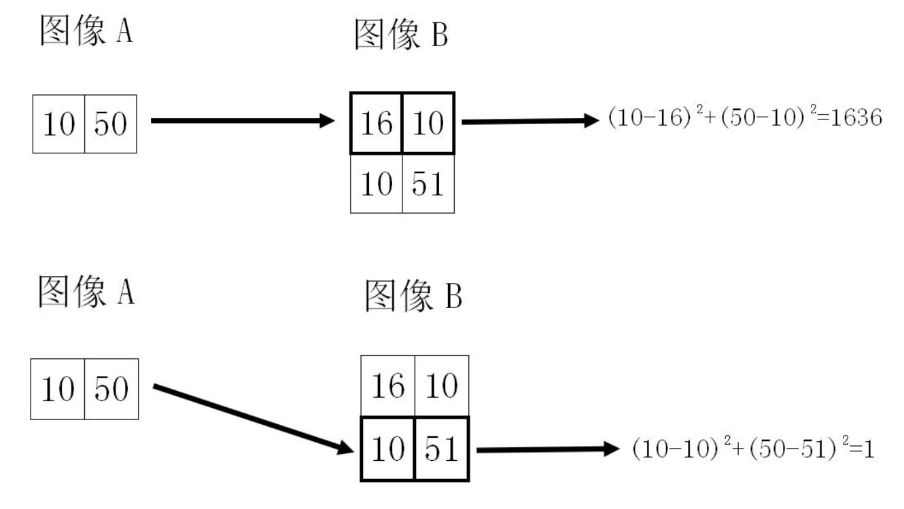
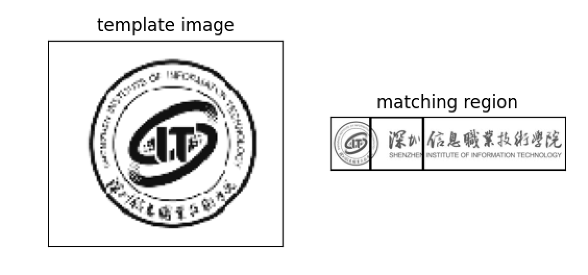
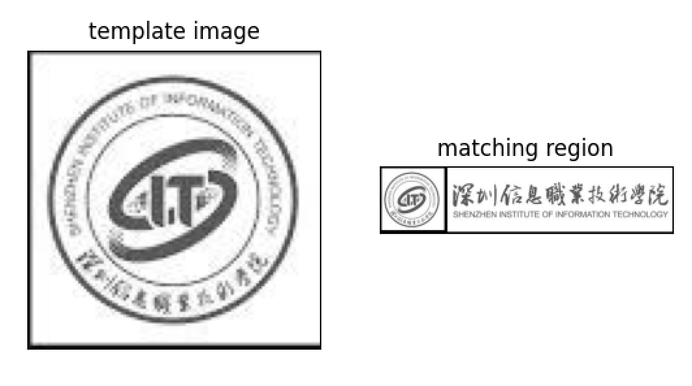
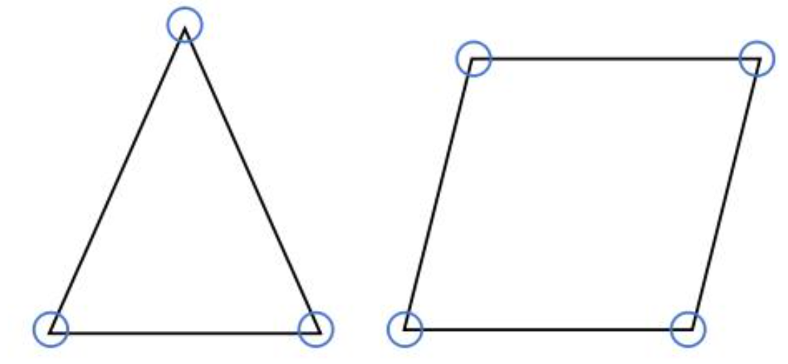
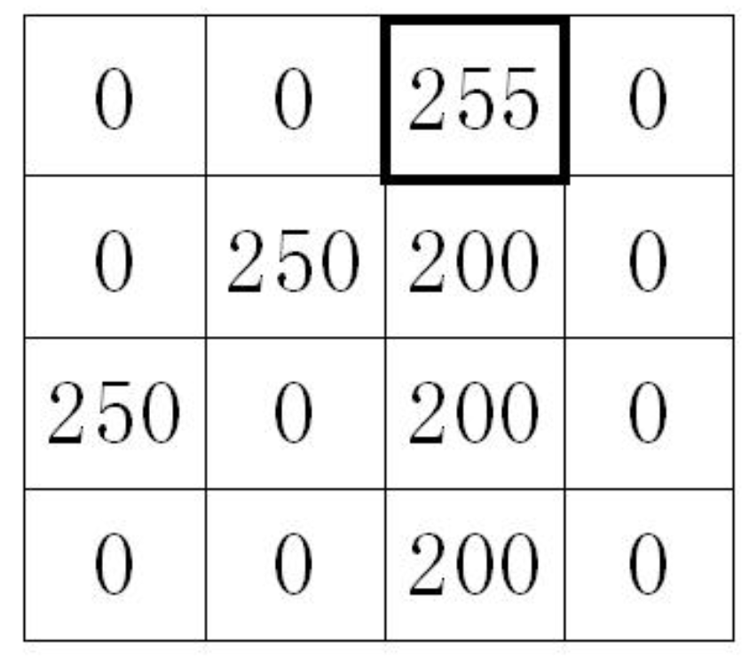
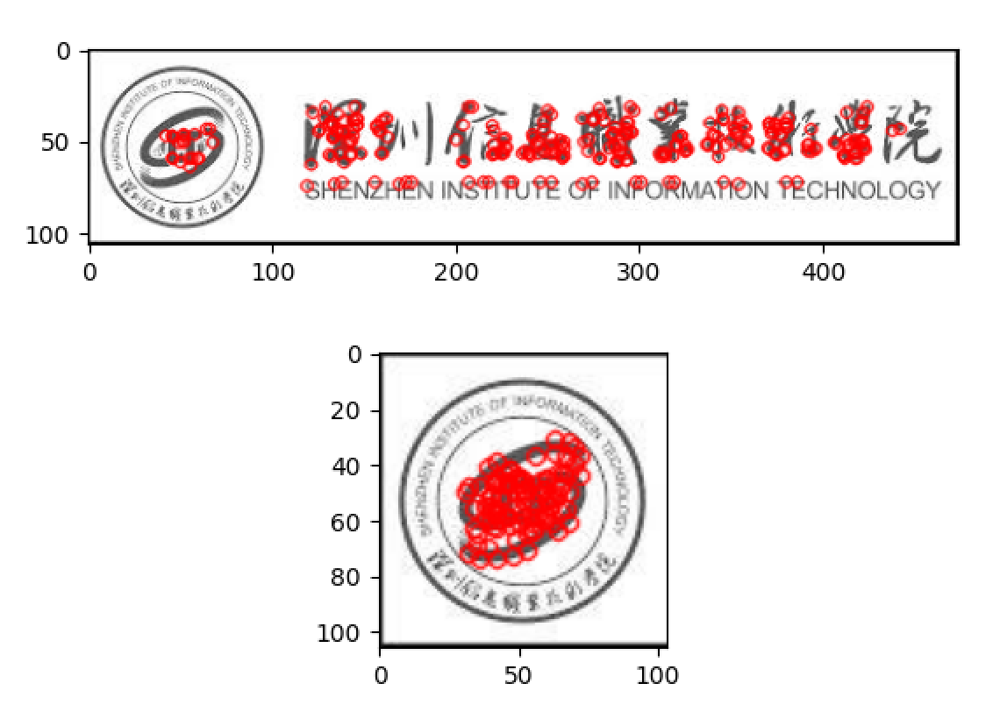
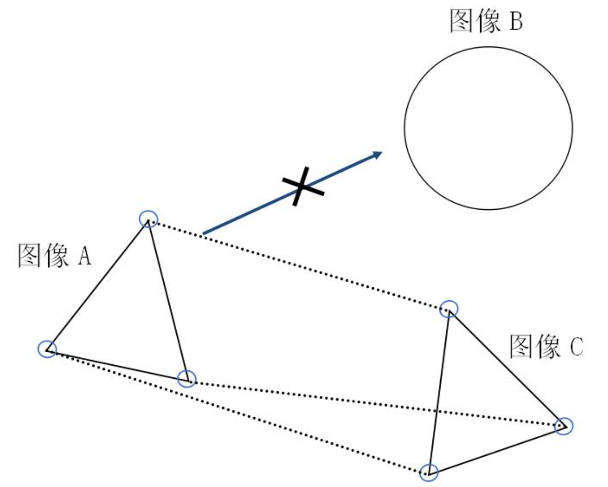
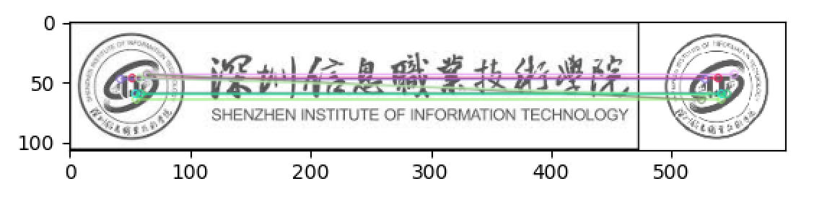
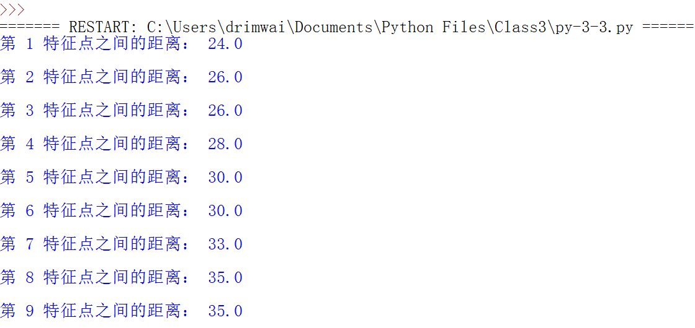

# 数字图像处理

本课程是图像处理的入门课程，用案例与任务形式来驱动读者进行数字图像处理相关的学习，以满足职业教育、应用型人才的发展要求。


## 第3章 图像匹配操作


### 课程目录

3.1. 模板匹配简介

3.2. 模板图像匹配操作

3.3. 角特征简介

3.4. 角特征提取操作

3.5. 特征匹配简介

3.6. 特征匹配操作


### 3.1. 模板匹配简介

​    模板匹配是一种最传统的模式识别方法，可分析识别出某一物体图像（图像模板）位于其他图像（目标图像）中的位置。这是数字图像处理中最基本、最常用的匹配方法。



<center>图3-1-1 模板匹配的简单事例</center>

​    以两幅单通道的灰度图像A与图像B为例，需要在图像B中寻找与图像A相似的部分（如图3-1-1所示）。在寻找的过程中，可以设定一个相似的规则：若图像A与图像B中的部分区域对应像素点上的像素值差值的平方和最小，则认为图像B中的该区域与图像A最为相似。


### 3.2. 模板图像匹配操作

- 本节任务

​    本节任务就是重现这种简单的匹配识别应用，需要自主搜索与下载两幅图像，其中一幅为目标图像，另一幅为模板图像，要求目标图像中包含有模板图像内容。使用模板匹配方法，在目标图像中查找与模板图像相似的物体。

- 代码

```python
import cv2 as cv
from  matplotlib import pyplot as plt
#读取目标图像
img = cv.imread('image-3-1.png',0)
#读取模板图像
template = cv.imread('image-3-2-1.png',0)
#获取模板图像行列
rows,cols = template.shape
#模板匹配
res = cv.matchTemplate(img,template,1)
min_val,max_val,min_loc,max_loc = cv.minMaxLoc(res)
#获取匹配区域左上顶点
top_left = min_loc
#获取匹配区域右下顶点
bottom_right = (top_left[0] + rows, top_left[1] + cols)
#获取匹配区域方框
cv.rectangle(img,top_left,bottom_right,0,3)
#用matplotlib里的画图函数框出匹配的区域
plt.subplot(121),plt.imshow(template,cmap='gray')
plt.title('template image'),plt.xticks([]),plt.yticks([])
plt.subplot(122),plt.imshow(img,cmap='gray')
plt.title('matching region'),plt.xticks([]),plt.yticks([])
plt.show()

```

- 执行效果



<center>图3-2-1 模板匹配效果</center>

​    如图3-2-1所示，左边的图像为模板图像，右边的图像为目标图像。很显然，从图中我们可以看出，通过这种简单的匹配方式，是无法准确地在真实环境中得到一个很好的匹配结果的。那么应该如何做呢？



<center>图3-2-2 模板匹配改进效果</center>

​    当我们对模板图像进行像素缩放，使其与目标图像中需要匹配的部分具有类似的像素值时，可以看到此时可以获得我们需要的匹配结果，如图3-2-2所示。那么，在实际生活中，这种简单的模板匹配有何实际作用呢？

- 习题

1. 如何获取图像的长、宽与通道数？
2. 两幅图像进行模板匹配需要用到什么函数，该函数传入的参数分别是什么？
3. 模板匹配有多少种计算方法，分别对应模板匹配函数的模板匹配方法参数的哪个值？
4. 彩色图像是否能直接进行模板匹配？请直接编写代码尝试。
5. 如何将在目标图像中，找到的模板图像相似度最高的位置区域设置为该兴趣区域，并且将感兴趣区域的图像显示与保存？


### 3.3. 角特征简介

​    什么是图像的特征？图像特征是能够表现图像显著特点的描述，例如图像的颜色、形状、纹理、关键点等。而模板匹配主要是依据两两图像之间，对应像素点位置与像素大小的关系，是像素级的特征。本节主要介绍角点特征，角点特征是图像中的显著关键点，例如两条边缘的交点、与周边颜色或强度相差最大的点。如图3-3-1所示，蓝色圆圈标记的区域就是生活中常见的典型角点。



<center>图3-3-1 典型角点/角特征实例</center>

​    假设有一副单通道的灰度图像，其每个像素点的灰度值均在0至255之间变化。如图3-3-2所示，该单通道图像中像素值急剧变化的点（即实例中灰度值255的位置）为两条边缘的交叉点，也就是我们要找的角点。



<center>图3-3-2 像素级角点实例</center>

### 3.4. 角特征提取操作

- 本节任务

​     采用**ORB（Oriented FAST and Rotated BRIEF）**算法提取一幅图像的角点特征，用以表示这幅图像的特点，比如三角形的三个顶点、四边形的四个顶点，以及桌子的拐角都属于典型的角点。角点特征可以用来进行特征匹配，在下一节将会介绍。本节的主要任务是将图像中物体或目标的角点检测并显示出来。

- 代码

```python
import numpy as np
import cv2 as cv
import matplotlib.pyplot as plt
#目标图像的读取
img1 = cv.imread('image-3-1.png',0)
img2 = cv.imread('image-3-2-2.png',0)
#初始化ORB特征点检测器
orb = cv.ORB_create()
#使用ORB检测器获取特征点
kp = orb.detect(img1,None)
#描述并表示特征点
kp, des = orb.compute(img1, kp)
#画出特征点在目标图像中的位置
img3 = cv.drawKeypoints(img1, kp, None, color=(0, 255, 0), flags = 0)
plt.subplot(211), plt.imshow(img3)
#提取另一张图像角特征
orb = cv.ORB_create()
kp = orb.detect(img2, None)
kp, des = orb.compute(img2, kp)
img3 = cv.drawKeypoints(img2, kp, None, color=(0, 255, 0), flags = 0)
plt.subplot(212), plt.imshow(img3),plt.show()
```

- 执行效果

​    本例依旧使用了模板匹配里的所用的两幅图像，分别对这两幅图像进行角点特征提取，并把角点用红色小园圈在图像中标出。如图3-4-1所示，学校LOGO与学校名称均检测出了许多角点。



<center>图3-4-1 角特征/角点提取实例</center>

- 习题

1. 什么是角点特征？如何获取ORB角点特征？除了ORB角点特征，还有哪些类型的角点特征？
2. OBR角点特征获取过程中，需要用到哪些函数，这些函数需要、传入哪些参数？
3. 角点特征如何绘制，需要用到什么函数，其参数是什么？
4. 下载多张不同类别、形状的图像，使用ORB算法进行角点特征提取，并对比分析这些图像之间角点特征的区别。
5. 是否能用角点特征来检测人眼、嘴、鼻？请下载或拍摄一张人脸正面图像尝试提取角点特征来验证该问题。


### 3.5. 特征匹配简介

​    在上一节，已经通过ORB算法提取出图像的角点特征，角点特征是一幅图像的显著特点的表示。在生活中，人们去比较两幅人脸图像是否相似，往往也是比较人脸的眼睛、鼻子、额头、嘴巴等显著的特点，而这些显著特点都能够检测出许多角点。特征匹配可以通过计算机比较两幅图像的角点特征来进行匹配，即在两幅图像中寻找是否能匹配上的角点（相似度高的角点）。



<center>图3-5-1 特征匹配实例</center>

​    一个简单的特征匹配实例如图3-5-1所示。有三幅图像A、B和C，其中A与C是三角形，B是圆形。由角特征的特点可知，图像A中的三个角点与图像B是无法匹配的，因为没有相似的角点特征。而图像A中的三个角点特征与图像C的三个角点特征及其相似，因此可以一一匹配起来。在匹配的过程中，可以发下，图像A与图像C处于不同的旋转角度，但不影响其角点的匹配。那么，如果A与C的图像大小不同，匹配结果又会如何？


### 3.6. 特征匹配操作

- 本节任务

​    本节的主要任务是利用ORB算法提取两幅图像的角点特征，这两幅图像可以是相似的，也可以是完全不相似的。在角点特征正确提取的情况下，利用暴力匹配算法，对两幅图像的角点特征一一比较，最终得到相似度最高的匹配点，以达到特征匹配的目的。

- 代码

```python
import numpy as np
import cv2 as cv
import matplotlib.pyplot as plt
#读取图像
img1 = cv.imread('image-3-1.png', cv.IMREAD_GRAYSCALE)
img2 = cv.imread('image-3-2-2.png',cv.IMREAD_GRAYSCALE)
#初始化orb检测器
orb = cv.ORB_create()
#使用orb检测器寻找并计算特征点描述符
kp1, des1 = orb.detectAndCompute(img1, None)
kp2, des2 = orb.detectAndCompute(img2, None)
#创建BFMatcher对象
bf = cv.BFMatcher(cv.NORM_HAMMING, crossCheck = True)
#角点特征符比较与匹配
matches = bf.match(des1, des2)
#按距离排序
matches = sorted(matches, key = lambda x:x.distance)
for i in range(1,10):
	print("第", i, "特征点之间的距离：", matches[i].distance, "\n")
#绘制前10个匹配
img3 = cv.drawMatches(img1, kp1, img2, kp2, matches[:10], None, flags = cv.DrawMatchesFlags_NOT_DRAW_SINGLE_POINTS)
plt.imshow(img3), plt.show()
```

- 执行效果

​    在本例中，所使用的两幅图像分别是学校LOGO图与学校旗帜图。其中学校旗帜图里包含了学校LOGO图像内容。如图3-6-1与图3-6-2所示，通过特征匹配成功将两幅图像之间相似度最高的角点匹配起来，并且只有相似度最高的学校LOGO的角点才能正确匹配，图像中其他内容的角点未被匹配。



<center>图3-6-1 特征匹配结果</center>



<center>图3-6-2 特征距离打印结果</center>

- 习题

1. 什么是特征匹配？特征匹配可以用来做什么？
2. 特征匹配是否需要检测图像的角点与计算对应的描述符，检测与计算需要用到什么函数？
3. 在已经检测出角点及对应的描述符后，对角点特征进行匹配，需要用到什么方法和函数？
7. 请对一个物体在不同角度进行拍照获得不同角度的图像，编写代码对这些图像进行特征匹配，观测结果并做相应说明。
8. 对不同物体进行拍照获得不同物体的图像，编写代码对这些图像进行特征匹配，观测结果并做相应说明。