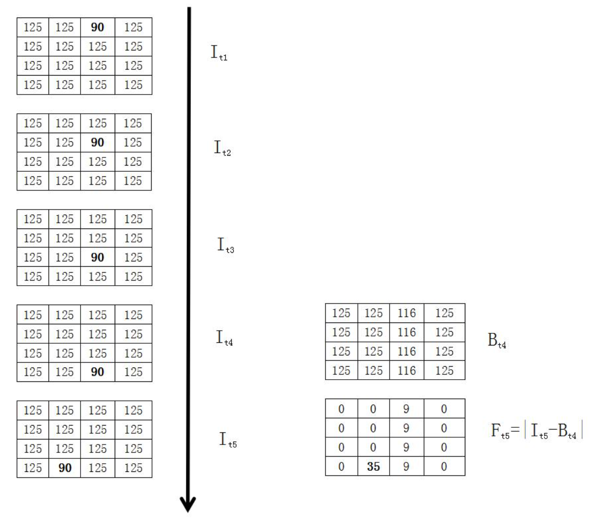
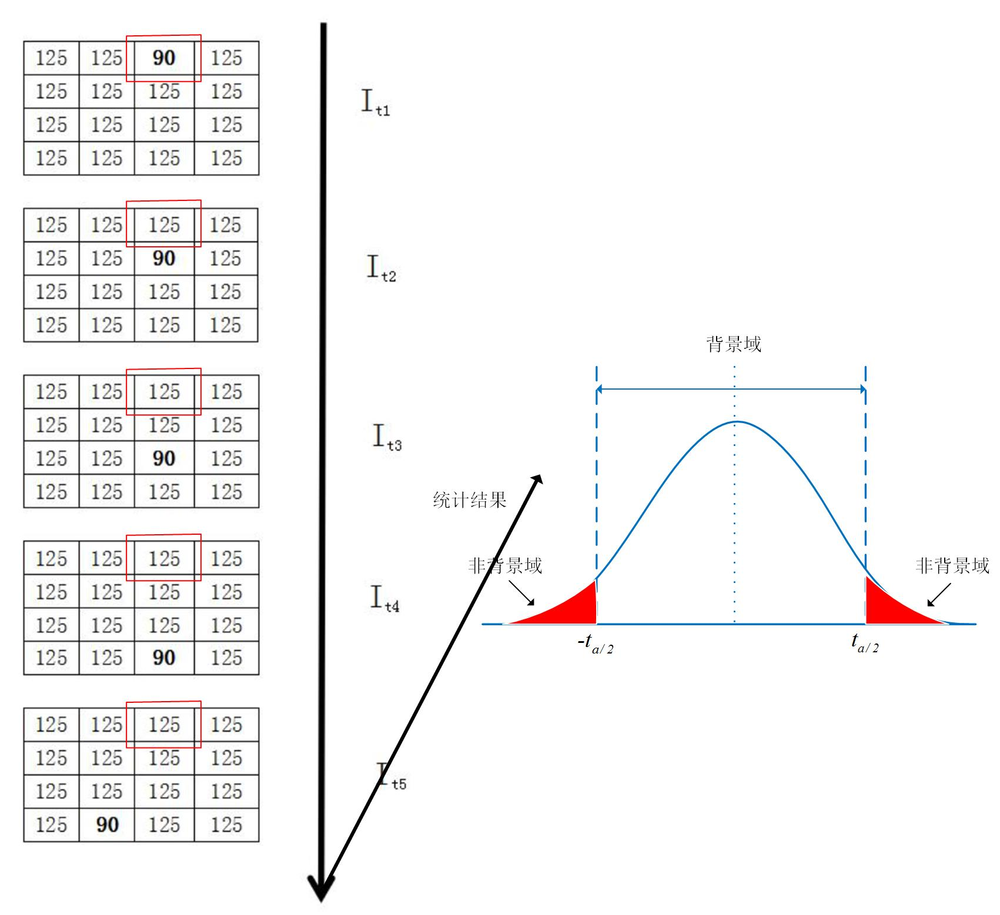
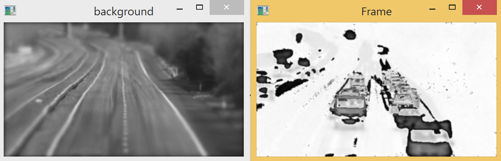
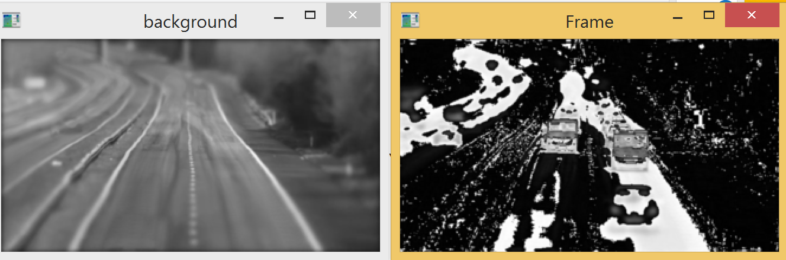
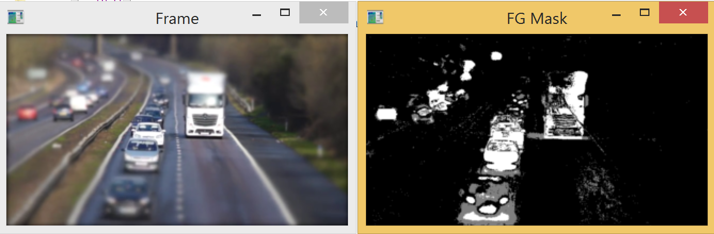
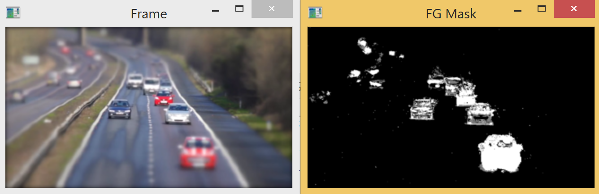
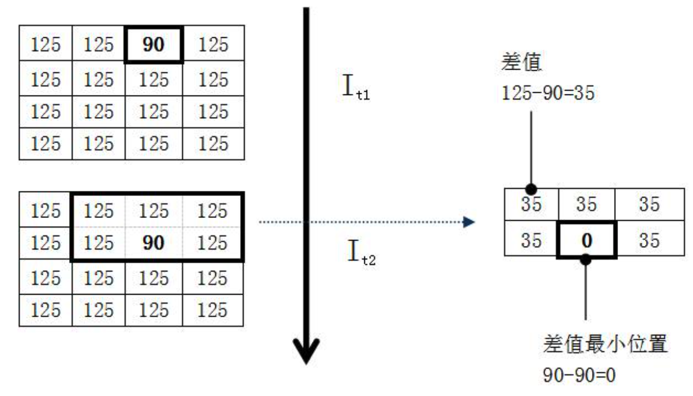
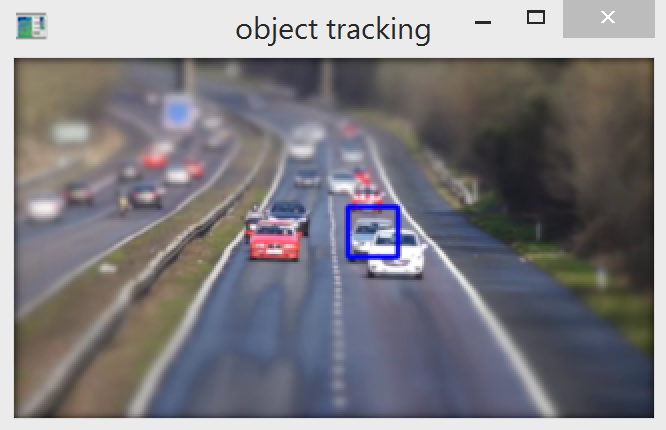
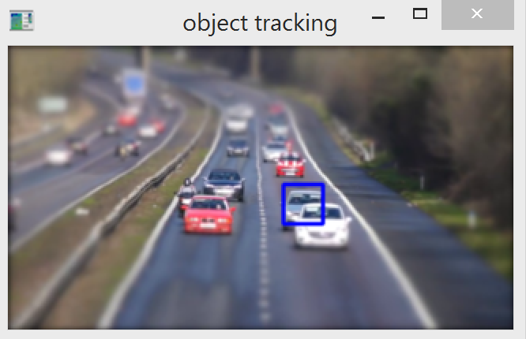
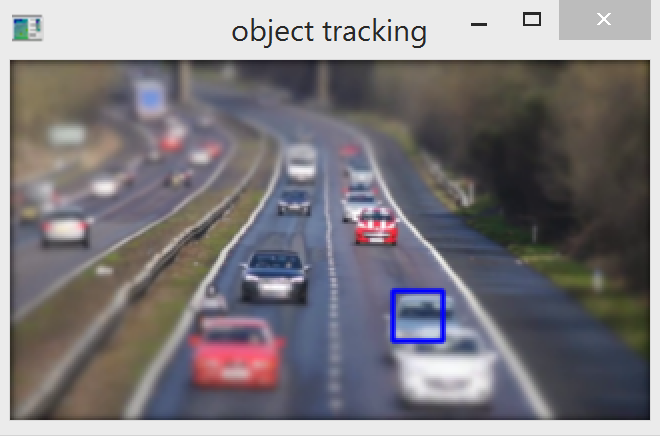

# 数字图像处理

本课程是图像处理的入门课程，用案例与任务形式来驱动读者进行数字图像处理相关的学习，以满足职业教育、应用型人才的发展要求。


## 第4章 物体检测与跟踪


### 课程目录

4.1. 运动物体检测简介

4.2. 运动物体检测操作

4.3. 目标跟踪简介

4.4. 目标跟踪基本操作


### 4.1. 运动物体检测简介

#### 4.1.1. 基于背景差分法的运动物体检测

​    在许多行业里，往往对处于运动状态的物体感兴趣，例如交通行业中运动中的车辆、安防行业中异常行动的人物、军事中移动的车辆、野地里跳跃的动物、田径场上奔跑的运动员等。运动的目标比静止的物体更容易被发现或检测。

​    最原始最常用的运动物体检测方法是背景差分法，即通过构建背景，将当前图像去除背景后，就能得到运动的物体。一幅图像中有大海，有小船，如果能够将大海这个背景去除，就能得到小船这个物体。背景的构建，往往是通过连续的视频图像帧获得的。背景构建方法又称背景建模，最常见的方法是背景差分法。



<center>图4-1-1 背景差分法进行背景构建实例</center>

​    背景差分法的基本原理如图4-1-1所示，假设从一个视频中连续读取了5幅图像，并且这5幅图像均为四行四列的单通道灰度图像，分别标记为$I_{t1}$、$I_{t2}$、$I_{t3}$、$I_{t4}$和$I_{t5}$。通过观察可以发现，有一像素点值为90，在这5幅图像中逐渐移动了位置。采用背景差分法，假设所有图像的权重均一致，则可以通过将前4幅图像直接相加求平均，得到所构建的背景$B_{t4}$。此时，将第5幅图像$I_{t5}$与构建的背景$I_{b}$进行相差并取绝对值，得到运动物体的前景图像$F_{t5}$。

​    在实际应用中，可以通过设置阈值，将小于阈值的对应像素点的像素值置为0，将大于像素点的对应像素值设置为255，以去除噪声点和显著提升运动物体位置。但在实际中很少有能如此简单、干净地去除背景的情形。

#### 4.1.2. 基于高斯背景建模法简介

​    高斯背景建模法是一种运动目标检测过程中提取并更新背景和前景的一种方法。单分布高斯背景建模法认为，对一个背景图像，特定像素亮度的分布满足高斯分布。一个简单的高斯背景建模法的实例如图4-1-2所示。



<center>图4-1-2 高斯建模法进行背景构建实例</center>

​    如图4-1-2所示，假设我们对图像中某个像素点进行一段时间的统计，我们可以得到一个符合高斯分布（正态分布）的函数，其中灰度值或像素值为自变量，其频次为因变量。不难想象，背景灰度作为频次较高的数值会落在背景阈中，而前景（移动物体）的灰度值会落在非背景阈中。由此，当我们获取到新的图像帧时，便可以通过统计得出高斯分布中的位置求出背景与前景（如背景像素点值赋为0，前景像素点赋值为255）。


### 4.2. 运动物体检测操作

- 本节任务

​    本节的主要任务是通过使用背景差分法对所读取的视频进行背景建模，获得视频中每一个图像帧对应的背景，通过将图像帧与所构建的背景进行相差，即可获得运动中的物体前景（所在位置）。

- 代码（背景差分法）

```python
import cv2 as cv
#读取视频
capture = cv.VideoCapture('video-4-1.mp4')
if not capture.isOpened:
	print('视频无法读取')
	exit(0)
#获取视频背景的灰度图像
ret, background_color = capture.read()
background_gray = cv.cvtColor(background_color, cv.COLOR_BGR2GRAY)
#背景差分法求背景图像与运动物体
while True:
	#获取视频的图像帧
  ret, frame = capture.read()
	if frame is None:
    break
  #获取图像帧的灰度图像
  frame_gray = cv.cvtColor(frame, cv.COLOR_BGR2GRAY)
  #加权平均法求背景图像
  background_gray = cv.addWeighted(background_gray, 0.98, frame_gray, 0.02, 0)
  rows, cols, _channels = map(int, frame.shape)
  background_realtime = cv.pyrDown(background_gray, dstsize = (cols//2, rows//2))
  cv.imshow('background', background_realtime)
  #获取当前运动物体
  fgMask = frame_gray - background_gray
  fgMask_realtime = cv.pyrDown(fgMask, dstsize = (cols//2, rows//2))
  cv.imshow('Frame', fgMask_realtime)
  #按键退出
  keyboard = cv.waitKey(30)
  if keyboard == ord('q') or keyboard == 27:
  	break
```

- 执行效果

​    如图4-2-1所示，本例对交通流视频进行运动物体检测，左图为播放的交通流视频，右图为背景差分法获得的运动物体前景，可见视频中道路背景被较好地去除，运动中的车辆被显著地表示出来。





<center>图4-2-1 背景差分法下两个随机时刻的背景与前景图</center>

- 代码（高斯背景建模法）

```python
import cv2 as cv
#初始化高斯背景建模变量
backSub = cv.createBackgroundSubtractorMOG2()
#读取视频
capture = cv.VideoCapture('video-4-1.mp4')
if not capture.isOpened:
  print('Video cannot be opened')
  exit(0)
#高斯建模法求背景与运动物体
while True:
  #获取视频的图像帧
  ret, frame = capture.read()
  if frame is None:
    break
  #高斯法获取运动物体
  fgMask = backSub.apply(frame)
  rows, cols, _channels = map(int, frame.shape)
  framesrc = cv.pyrDown(frame, dstsize = (cols//2, rows//2))
  cv.imshow('Frame', framesrc)
  rows, cols, _channel = map(int, frame.shape)
  fgMasksrc = cv.pyrDown(fgMask, dstsize = (cols//2, rows//2))
  cv.imshow('FG Mask', fgMasksrc)
  #按键退出
  keyboard = cv.waitKey(30)
  if keyboard == 'q' or keyboard == 27:
    break
```

- 执行效果





<center>图4-2-2 高斯法下两个随机时刻的背景与前景图</center>

- 习题

1. 加权平均法和高斯建模法的基本原理是什么？
2. 如何用代码转化图像的色彩空间？
3. 哪种方法能准确获得视频图像帧的背景，请用代码实现？
4. 哪种方法能准确获得视频图像帧的运动物体前景，请用代码实现？
5. 请下载或采集一段包含运动物体的视频，代码实现运动物体检测。
6. 请下载或采集一段堵车视频，实现运动物体检测并观察结果。


### 4.3. 目标跟踪简介

​    不管是运动物体还是静止物体，当物体或目标被正确检测到之后，其轨迹、行进方向的信息十分重要。简单来说，这些信息包括是什么、从哪儿来、到哪儿去，目标跟踪就是为了获得这些信息。一张图像是无法对物体进行跟踪的，因为一张图片只表示一个时刻的信息，因此目标跟踪主要应用于视频信息流中。由前面一系列章节学习可知，视频是包含时间上连续的多个图像，目标跟踪就是去分析这些图像物体的轨迹、位置与行进方向。   

​    通过背景差分法可以检测到运动物体，但若运动物体不再运动了，是否能继续检测到物体呢？即物体由运动转变为静止或缓慢移动无法检测时，就需要用到目标跟踪来对物体进行跟踪监测。目标跟踪可以独立于物体检测，在跟踪前可以人工标记物体位置，则后续就无需进行物体检测直接跟踪该目标。



<center>图4-3-1 目标跟踪计算示例</center>

​     如图4-3-1所示，在一个视频中有两幅相邻时刻的图像，其中图像$I_{t1}$中有一像素值为90的像素点移动到了图像$I_{t2}$中其他位置，人眼可以直接观测判断到所移动的位置。对于计算机来说，需要设定一个规则，就是现在图像$I_{t1}$中标记好像素点90的初始位置。下一时刻，需要将图像$I_{t1}$​中的目标初始位置的像素点与下一时刻该像素点附近的所有像素点进行比较，找到差值最小的像素点位置。在图中，目标初始位置临近像素点像素值差值最小为0，则该差值对应的像素点位置即为跟踪到的目标新位置。


### 4.4. 目标跟踪操作

- 本节任务

实际应用中，没有如4.3中如此简单干净的情形，需要采用不同的方法和参数进行目标跟踪。比如，采用对目标区域进行直方图反向投影后的meanshift目标跟踪方法。实际中的目标跟踪应用可以是针对已经保存下来的视频文件，也可以是针对单个摄像头实时的视频信息流，也可以是针对不同位置安装的多个摄像头信息流。

- 代码

```python
import numpy as np
import cv2 as cv
#读取视频
cap = cv.VideoCapture('video-4-1.mp4')
ret, frame = cap.read()
#初始化跟踪窗口
x, y, w, h = 250, 150, 50, 50
track_window = (x, y, w, h)
#初始化感兴趣区域，并转化为统计直方图
roi = frame[y:y+h, x:x+w]
hsv_roi = cv.cvtColor(roi, cv.COLOR_BGR2HSV)
#设置跟踪窗口移动范围
mask = cv.inRange(hsv_roi, np.array((0., 60., 32.)), np.array((180., 255., 255.)))
#统计图像直方图信息
roi_hist = cv.calcHist([hsv_roi], [0], mask, [180], [0, 180])
#直方图归一化
cv.normalize(roi_hist, roi_hist, 0, 255, cv.NORM_MINMAX)
#设置迭代条件
term_crit = (cv.TERM_CRITERIA_EPS|cv.TERM_CRITERIA_COUNT, 10, 1)
#循环跟踪目标
while True:
  ret, frame = cap.read()
  if ret == True:
    hsv = cv.cvtColor(frame, cv.COLOR_BGR2HSV)
    #直方图反向投影
    dst = cv.calcBackProject([hsv], [0], roi_hist, [0, 180], 1)
    #使用meanshift方法跟踪目标新位置
    ret, track_window = cv.meanShift(dst, track_window, term_crit)
    #绘制出新目标位置
    x, y, w, h = track_window
    img2 = cv.rectangle(frame, (x, y), (x+w, y+h), 255, 4)
    rows, cols, _channels = map(int, img2.shape)
    print(x, y, w, h, rows, cols)
    #跟踪目标离开视频区域，恢复窗口初始值
    if (y+h)>0.95*rows:
      x, y, w, h = 250, 150, 50, 50
      track_window = (x, y, w, h)
    #显示图像
    cv.imshow('object tracking', img2)
    #按键退出
    keyboard = cv.waitKey(30)
    if keyboard == 'q' or keyboard == 27:
      break
```

- 执行效果

<center></center>

<center>图4-4-1 目标跟踪效果图</center>

- 习题

1. 如何用代码设置感兴趣区域与跟踪窗口？
3. 如何用代码计算图像的直方图？如何用代码进行直方图归一化？
4. 如何用代码实现直方图反向投影？
5. 如何用代码实现meanshift目标跟踪，需要用的什么函数，需要传入什么参数？
6. 下载或采集一段视频，分别初始化跟踪窗口到运动物体或静止物体，代码实现目标跟踪，并观察结果。

