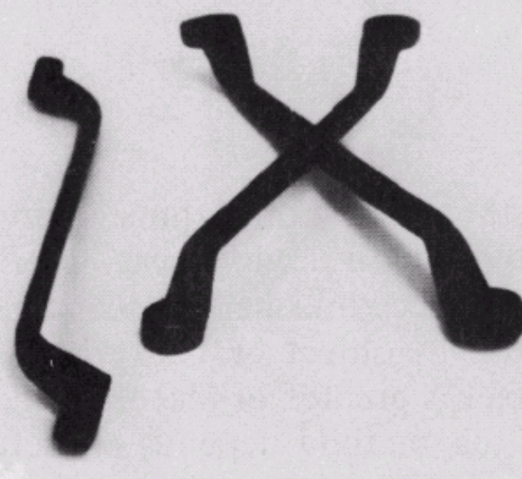
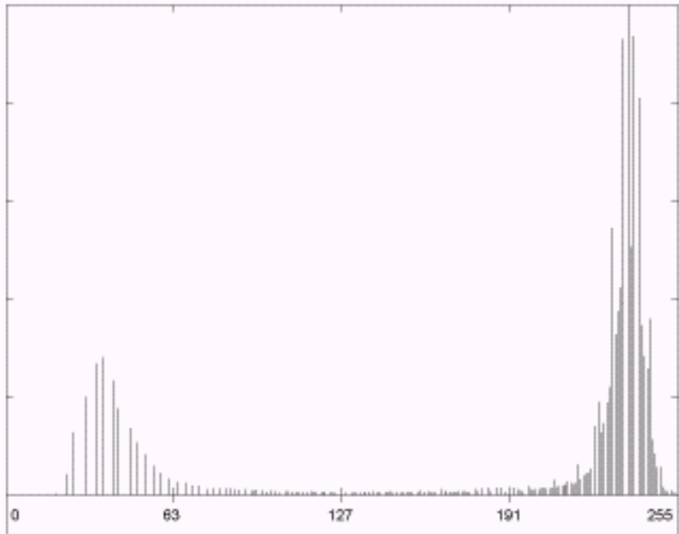
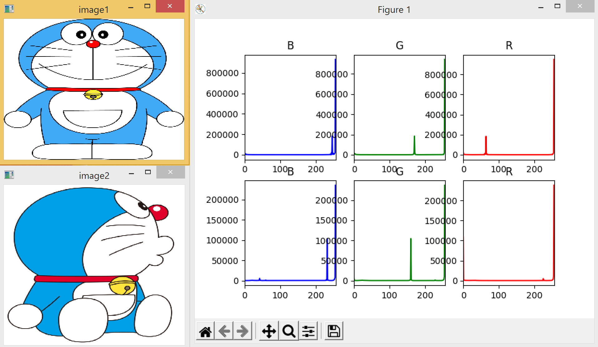
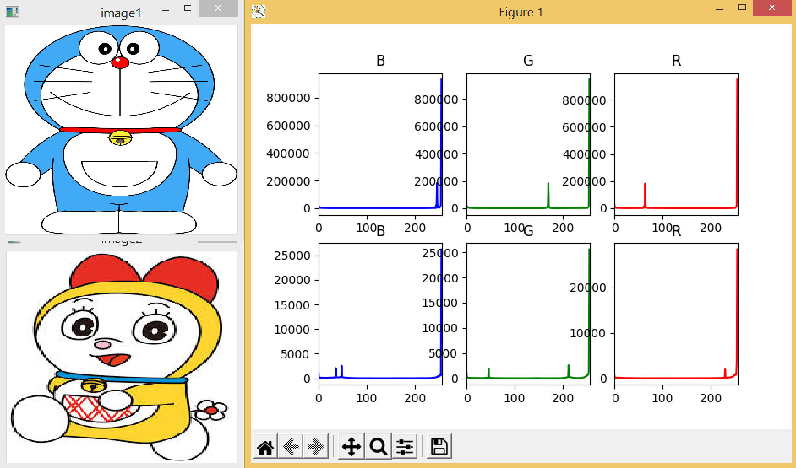
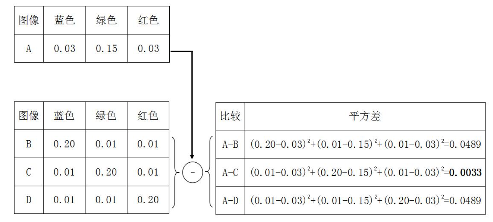
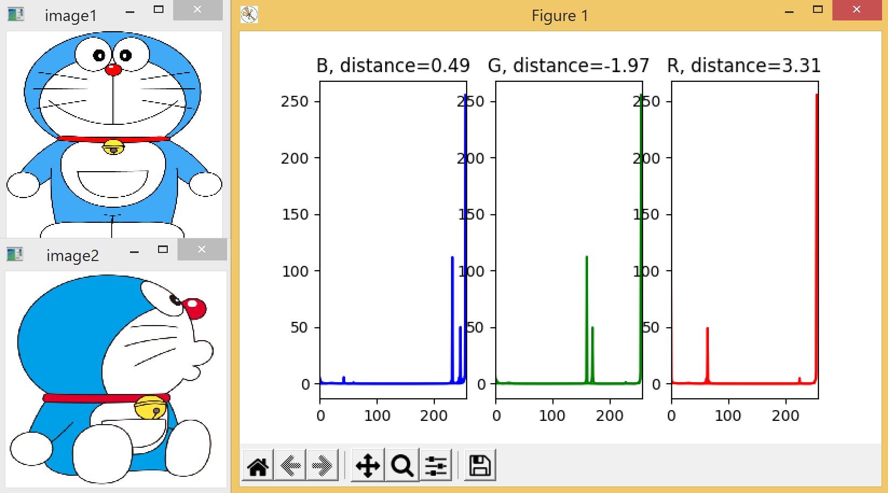
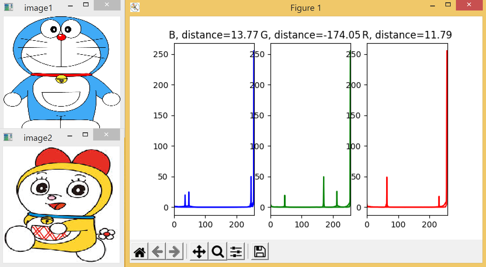
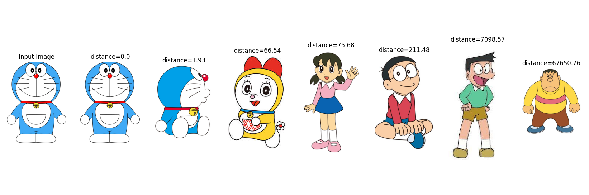

# 数字图像处理

本课程是图像处理的入门课程，用案例与任务形式来驱动读者进行数字图像处理相关的学习，以满足职业教育、应用型人才的发展要求。


## 第5章 图像颜色特征检索


### 课程目录

5.1. 颜色直方图简介

5.2. 颜色直方图提取操作

5.3. 基于直方图距离的图像检索简介

5.4. 基于直方图距离的图像检索操作


### 5.1. 颜色直方图简介

​    观察颜色是人类观测事物最显著的方式。在现实生活中，事物往往是丰富多彩的。例如，香蕉是黄色、苹果是红色、青苹果是绿色、天空与海洋是蓝色、斑马是黑白相间等等。每一个事物都有自己的颜色，包括人穿的衣服，也是色彩各不相同。因此，可以用颜色来描述一个事物的特点。那如何来提取颜色特征并表示这些特征呢？这就需要用到统计学上的直方图的概念。

​    直方图最简单的例子是统计班级上数学成绩分布情况，例如不及格的人数为1人，60分至69分之间的人数是20人，70分至89分的人数是15人，90分以上的人数是6人。在这个例子中，首先是划定区间，其次是基于所划定的区间统计符合该区间的数量。这就是直方图的基本原理。

<center>    </center>

<center>图5-1-1 灰度统计直方图</center>

​    以单通道的灰度图像为例，将图像中的每个像素点按照不同的灰度级别进行统计，便可得到其灰度统计直方图。由图5-1-1可知，图像的灰度值主要集中在两个区域，分别是高亮度的背景区域和低亮度的物体区域。三通道的彩色图像的统计直方图的提取方式类似，只不过是从灰度的统计扩展到R、G、B三个通道的统计。利用直方图表示的颜色特征，可以用于图像的色彩分析、色彩转换、图像分割、图像去噪以及图像搜索等领域。


### 5.2. 颜色直方图提取操作

- 本节任务

​    下载两幅相同/不同类型的图像进行三通道的彩色直方图统计，并展示出两幅图像的三通道直方图的差异。

- 代码

```python
import cv2 as cv
from matplotlib import pyplot as plt
#读取两个图像
img1 = cv.imread('image-4-1.png',1)
img2 = cv.imread('image-4-2.png',1)
cv.imshow('image1',img1)
cv.imshow('image2',img2)
#彩色图像的三通道
color = ('b','g','r')
#计算画出图像1的直方图
for i, col in enumerate(color):
  histr = cv.calcHist([img1], [i], None, [256], [0, 256])
  if i == 0:
    plt.subplot(231)
    plt.title('B')
    plt.plot(histr, color = col)
    plt.xlim([0, 256])
  if i == 1:
    plt.subplot(232)
    plt.title('G')
    plt.plot(histr, color = col)
    plt.xlim([0, 256])
  if i == 2:
    plt.subplot(233)
    plt.title('R')
    plt.plot(histr, color = col)
    plt.xlim([0, 256])
#计算画出图像2的直方图
for i, col in enumerate(color):
  histr = cv.calcHist([img2], [i], None, [256], [0, 256])
  if i == 0:
    plt.subplot(234)
    plt.title('B')
    plt.plot(histr, color = col)
    plt.xlim([0, 256])
  if i == 1:
    plt.subplot(235)
    plt.title('G')
    plt.plot(histr, color = col)
    plt.xlim([0, 256])
  if i == 2:
    plt.subplot(236)
    plt.title('R')
    plt.plot(histr, color = col)
    plt.xlim([0, 256])
plt.show()
```

- 执行效果

​    如图5-2-1所示，通过运行代码，可以显示两幅不同的哆啦A梦图像，以及对应的三通道BGR颜色直方图。通过观察三通道的颜色直方图可知，三个通过的颜色直方图峰值位置与形状近似，即两幅不同的多啦A梦的颜色是近似的。



<center>图5-2-1 灰度统计直方图</center>



<center>图5-2-2 灰度统计直方图</center>

​    如图5-2-2所示，在排除背景色后，哆啦A梦与多啦妹的RGB三通道锋值差异较大。可以判断两者的颜色是不相似的。

- 习题

1. 相同物体的不同角度图像会影响其颜色直方图吗？
2. 把RGB三通道图像转化为灰度单通道图像，直方图变化如何？


### 5.3. 基于直方图距离的图像检索简介

​    在上一节，已经获取到图像的颜色特征，可以利用颜色特征（颜色统计直方图）进行图像检索。举一个简单的例子，假设有一幅输入图像A，三幅待检索图像B、C与D。其RGB三通道的统计直方图对应归一化结果已经获取，并用一个值来代替整个颜色区间，如图5-3-1所示。归一化指的是基于图像像素的总个数将绝对值转化为相对值，已达到的可以直接比较而不受量纲影响。



<center>图5-3-1 直方图距离计算示例</center>

​    由图可知，经过图像A分别与图像B、C、D进行归一化表，A与C的直方图平均差最小为0.0033。根据最小差值相似原则，可以判定图像A与图像C最相似，图像A与图像B、D相似度并列第二。因此可以返回图像A的最相似图像为图像C，此相似图像为图像B或D。


### 5.4. 基于直方图距离的图像检索操作

- 本节任务

​    本节的主要任务是基于颜色直方图与直方图比较的原理，分析比对不同图像，并利用OpenCV库函数实现基于颜色的图像检索功能。

- 代码（两幅图像比较）

```python
import cv2 as cv
from matplotlib import pyplot as plt
#读取图像
img1 = cv.imread('image-5-1.png',1)
img2 = cv.imread('image-5-2.png',1)
cv.imshow('image1', img1)
cv.imshow('image2', img2)
#三通道图像参数获取
color = ('b', 'g', 'r')
w1, h1, c1 = img1.shape
w2, h2, c2 = img2.shape
#计算并画出三通道直方图
for i, col in enumerate(color)：
	#统计直方图
  histr1 = cv.calcHist([img1], [i], None, [256], [0, 256])
  cv.normalize(histr1, histr1, 0, 255, cv.NORM_MINMAX)
  histr2 = cv.calcHist([img2], [i], None, [256], [0, 256])
  cv.normalize(histr2, histr2, 0, 255, cv.NORM_MINMAX)
  #比较直方图，获取直方图距离
  difference = cv.compareHist(histr1, histr2, cv.HISTCMP_CHISQR)
  difference = difference/(w1*h1+w2*h2)
  if i == 0:
    plt.subplot(131)
    title = 'B, distance=' + str(round(difference, 2))
    plt.title(title)
    plt.plot(histr1, color = col)
    plt.plot(histr2, color = col)
    plt.xlim([0, 256])
  if i == 1:
    plt.subplot(132)
    title = 'G, distance=' + str(round(difference, 2))
    plt.title(title)
    plt.plot(histr1, color = col)
    plt.plot(histr2, color = col)
    plt.xlim([0, 256])
  if i == 2:
    plt.subplot(133)
    title = 'R, distance=' + str(round(difference, 2))
    plt.title(title)
    plt.plot(histr1, color = col)
    plt.plot(histr2, color = col)
    plt.xlim([0, 256])
plt.show()
```

- 执行效果



<center>图5-4-1 两幅相似图像三通道直方图比较</center>

​    选择两张哆啦A梦的图像直接比较，效果如图5-4-1所示。本例是将两幅哆啦A梦图像的三个通道直方图画在一起，即例如B通道子图中画出了两幅图像的B通道直方图。由该图可知，这两幅图像的三个通道直方图画在一起后，距离较近、重叠部分较多。因此，可以初步判断两幅图像颜色特征非常相似。



<center>图5-4-2 两幅不同图像三通道直方图比较</center>

​    选择一张哆啦A梦图像与一张多啦美的图像进行比较，效果如图5-4-2所示。这两幅图像的三个通道直方图画在一起后，R、G、B三个通道的距离都非常的大。通过计算，两幅图像之间R、G、B通道的距离分别为11.79、174.05、13.77。因此，可以判断两幅图像颜色特征不相似。

- 代码（图像检索）

```python
import cv2 as cv
from matplotlib import pyplot as plt
import sys
#定义两幅图像直方图比较函数，获得距离
def getHistDistance(file1, file2):
	img1 = cv.imread(file1, 1)
	img2 = cv.imread(file2, 1)
	color = ('b', 'g', 'r')
  w1, h1, c1 = img1.shape
  w2, h2, c2 = img2.shape
  totalDistance = 0
  for i, col in enumerate(color):
    histr1 = cv.calcHist([img1], [i], None, [256], [0, 256])
    histr2 = cv.calcHist([img2], [i], None, [256], [0, 256])
    difference = cv.compareHist(histr1, histr2, cv.HISTCMP_CHISQR)
    difference = difference/(w1*h1+w2*h2)
    totalDistance = totalDistance + abs(difference)
  totalDistance = totalDistance/3
  return totalDistance
#定义需要比较的图像与距离集合
fileList = ['image-5-1.png', 'image-5-2.png', 'image-5-3.png', 'image-5-4.png', 'image-5-5.png', 'image-5-6.png', 'image-5-7.png']
fileForCompare = 'image-5-1.png'
fileDistanceList = [0,0,0,0,0,0,0]
#获取搜索图像文件与输入图像直方图的实际距离
for i, file in enumerate(fileList):
  distance = getHistDistance(fileForCompare, file)
  fileDistanceList[i] = distance
  print(round(distance, 2))
print(fileDistanceList)
#使用选择法对直方图距离排序，并存入排序文件列表
for i, distance in enumerate(fileDistanceList):
  min_idx = i
  for j in range(i+1, len(fileDistanceList)):
    if fileDistanceList[min_idx] > fileDistanceList[j]:
      min_idx = j
    fileDistanceList[i], fileDistanceList[min_idx] = fileDistanceList[min_idx], fileDistanceList[i]
    fileList[i], fileList[min_idx] = fileList[min_idx], fileList[i]
print('排序后的数组：')
total = len(fileList)
#画出排序后的图像
imgShow = cv.imread(fileForCompare, 1)
b, g, r = cv.split(imgShow)
imgShow2 = cv.merge([r, g, b])
plt.subplot(1, total+1, 1)
title = 'Input Image'
plt.title(title)
plt.imshow(imgShow2)
plt.axis('off')
plt.tight_layout()
#画出按直方图距离由小到大排序的图像
for i, file in enumerate(fileList):
  print('%s' %fileList[i])
  print('%s' %fileDistanceList[i])
  imgShow1 = cv.imread(file, 1)
  b, g, r = cv.split(imgShow1)
  imgShow2 = cv.merge([r, g, b])
  plt.subplot(1, total+1, i+2)
  title = 'distance=' + str(round(fileDistanceList[i], 2))
  plt.title(title)
  plt.imshow(imgShow2)
  plt.axis('off')
  plt.tight_layout()
plt.show()
```

- 执行效果



<center>图5-4-3 图像检索结果</center>

- 习题

1. 为什么需要比较三通道和颜色直方图？
2. 是否可以用特征匹配里的角点特征距离替代颜色直方图距离？
3. 黑白图像是否可以检索？
4. 图像文件目录中有同一颜色不同物体的图像，是否能检索成功？

