# 数字图像处理

本课程是图像处理的入门课程，用案例与任务形式来驱动读者进行数字图像处理相关的学习，以满足职业教育、应用型人才的发展要求。


## 第6章 人工智能基本原理


### 课程目录

6.1. 人工智能发展史

6.2. 人工智能的应用

6.3. 梯度下降算法

6.4. 神经网络


### 6.1. 人工智能发展史

#### 6.1.1. 图灵测试（1950年）

图灵测试（英语：Turing test）是英国计算机科学家图灵于1950年提出的思想实验，目的在测试机器能否表现出与人等价或无法区分的智能。测试中的谈话管道仅限于使用文本，例如计算机键盘和屏幕，这样的结果不依赖于计算机把单词转换为音频的能力。

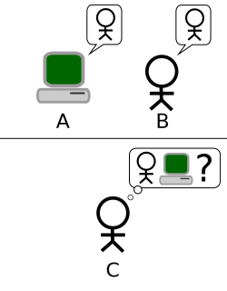

**测试内容：**

如果一个人（代号C）使用测试对象皆理解的语言去询问两个他不能看见的对象任意一串问题。对象为：一个是正常思维的人（代号B）、一个是机器（代号A）。如果经过若干询问以后，C不能得出实质的区别来分辨A与B的不同，则此机器A通过图灵测试。

2014年，终于有一台机器被认为是一个13岁的小男孩，从而通过了图灵测试。

#### 6.1.2. 达特茅斯会议（1956年）

達特矛斯夏季人工智慧研究計劃（英語：Dartmouth Summer Research Project on Artificial Intelligence）由约翰·麦卡锡、马文·明斯基与克劳德·香农于1956年8月31日发起，旨在召集志同道合的人共同讨论“人工智能”（此定义正是在那时提出的）。会议持续了一个月，基本上以大范围的集思广益为主。这催生了后来人所共知的人工智能革命。

因此，约翰·麦卡锡和马文·明斯基双双获得“图灵奖（计算机领域的诺贝尔奖）”。

#### 6.1.3. 发展简史总结


### 6.2. 人工智能的应用

#### 6.2.1. 自然语言处理

<video id='video' controls="" preload="none"><source id="mp4" src="videos/NLP.mp4" type="video/mp4"></video>

#### 6.2.2. 图像识别

<video id='video' controls="" preload="none"><source id="mp4" src="videos/face recognition.mp4" type="video/mp4"></video>

#### 6.2.3. 智慧城市

<video id='video' controls="" preload="none"><source id="mp4" src="videos/smart city.mp4" type="video/mp4"></video>

#### 6.2.4. 机器人

<video id='video' controls="" preload="none"><source id="mp4" src="videos/robot.mp4" type="video/mp4"></video>

#### 6.2.5. 其他应用


### 6.3. 梯度下降算法（重要）

梯度下降法（英语：Gradient descent）是一个一阶最优化算法，通常也称为最陡下降法。 要使用梯度下降法找到一个函数的局部极小值，必须向函数上当前点对应梯度（或者是近似梯度）的反方向的规定步长距离点进行迭代搜索。如果相反地向梯度正方向迭代进行搜索，则会接近函数的局部极大值点；这个过程则被称为梯度上升法。

#### 6.3.1. 房价预测案例

假设存在如下 **m** 组房价数据：

| 面积($m^2$) | 价格(万元) |
| :---------: | :--------: |
|    82.35    |    193     |
|    65.00    |    213     |
|   114.20    |    255     |
|    75.08    |    128     |
|    75.84    |    223     |
|     ...     |    ...     |

通过上面的数据，可以做出如下一个图。横坐标是 **面积($m^2$)**，纵坐标是**价格(万元)**：

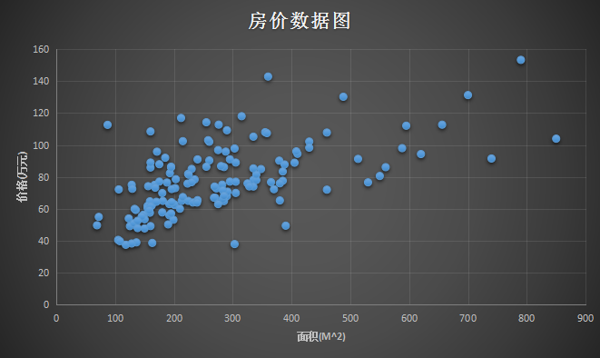

那么问题来了，给你这样一组数据，或者给你这样一个训练数据的集合，能否预测房屋的面积大小和房价之间的关系？

#### 6.3.2. 问题解决步骤

存在如下符号假设：

> **m** 为训练数据
> **x** 为输入特征，即房子的大小
> **y** 为输出结果，即房子的价格
> **(x, y)** 为一个样本，即表格中一行代表一个训练样本
> **(𝑥(𝑖),𝑦(𝑖))** 为第 **i** 个训练样本

在机器学习中，我们一般会这样做：

> 1. 首先找到一个训练集合
> 2. 提供样本 **m** 给算法构建模型（函数），用 $ℎ(𝑥)$ 表示
> 3. 采用样本 **m** ，使 $ℎ(𝑥)$ 进行学习并优化其模型参数
> 4. 给 $ℎ(𝑥)$ 提供未学习过的测试样本，由此测试 $ℎ(𝑥)$ 的实用性

**构建模型**

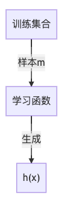

**训练模型（梯度下降）**

为了设计学习算法(学习函数)，假设存在如下函数：
$$
h(x)=\omega x+b
$$
其中 $𝑥$ 是一个输入函数，这里代表输入的面积($m^2$)，$h(x)$ 是一个输出函数，这里代表输出的价格(万元)，$\omega$ 是函数的参数，是需要根据样本学习的参数。

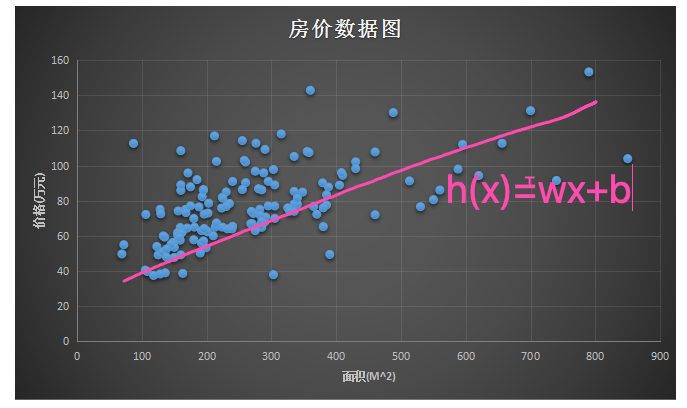

**测试模型**

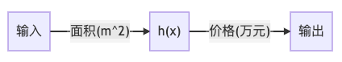

#### 6.3.3. （训练函数）梯度下降

在拥有足够多的训练数据，例如上面的房价数据，怎么选择(学习)出参数 $\omega$ 出来？一个合理的方式是使学习函数 $h(x)$ 学习出来的预测值无限接近实际房价值 $y$。假设**样本误差和（损失函数）**表示为：
$$
损失函数： J=\frac{1}{2m}\sum_i[y_i-(\omega x_i+b)]^2
$$
如何优化损失函数？答案：**梯度下降算法**

**步骤一**，将 $\omega$ 作为横坐标，$J$ 作为纵坐标，则图像可以变化为如下曲线：

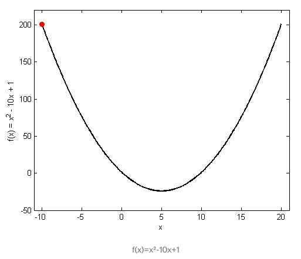

**步骤二**，求 $\omega$ 的偏导数 $\frac{\partial J}{\partial \omega}$ 以显示步骤一函数的倾斜程度，并进行迭代如下迭代：
$$
\omega_{n+1}=\omega_{n}-\eta\frac{\partial J}{\partial \omega}
$$
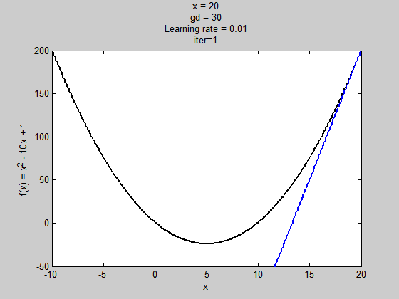

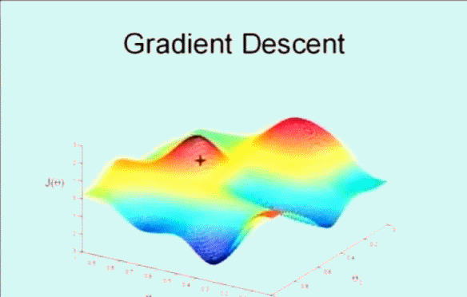

**步骤三**，当  $\frac{\partial J}{\partial \omega_{n+1}}=0$ 、$\frac{\partial J}{\partial \omega_{n+1}}=\frac{\partial J}{\partial \omega_{n}}$ 或达到最大学习次数的时候，则梯度下降完成。找到学习后的房价预测函数（模型）


### 6.4. 神经网络概述（了解）

房价往往不仅仅限于面积一个因素，有可能与多个因素有关，比如：城市、距离市中心距离、环境、朝向、开发商信誉等。此时，我们还能采用经验来建模吗？

**答案是不能的。因此，我们需要引入神经网络。**

#### 6.4.1. 单个神经元结构

单个神经元模型是一个包含输入，输出与计算功能的模型。输入可以类比为神经元的树突，而输出可以类比为神经元的轴突，计算则可以类比为细胞核。下面我们对单个神经元模型进行渐进式的介绍：

**特点一**：多输入单输出

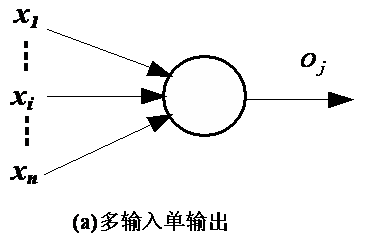

图(a)  表明，正如生物神经元有许多激励输入一祥，人工神经元也应该有许多的输入信号，图中每个输入的大小用确定数值 $x_{i}$ 表示，它们同时输入神经元 $j$，神经元的单输出用 $o_j$ 表示。

**特点二**：输入类型分别为兴奋性和抑制性

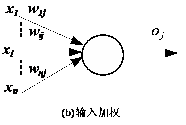

生物神经元具有不同的突触性质和突触强度，其对输入的影响强弱也不同。图(b)中对神经元的每一个输入都有一个加权系数 $w_{ij}$，称为权重值，其正负模拟了生物神经元中突触的兴奋和抑制，其大小则代表了突触的连接强度。

**特点三**：空间整合特性和阈值特性

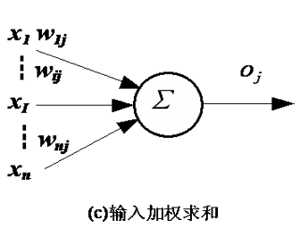

作为ANN的基本处理单元，必须对全部输入信号进行整合，以确定各类输入的作用总效果。图(c)表示组合输人信号的“总和值”，相应于生物神经元的膜电位。神经元激活与否取决于某一阈值电平，即只有当其输入总和超过阈值时, 神经元才被激活而发放脉冲, 否则不会产生输出信号。

**特点四**：激活函数

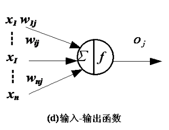

图(d) 人工神经元的输出也同生物神经元一样仅有一个，如用 $o_j$ 表示神经元输出，输出与输入之间的对应关系可用图(d)中的某种函数 $f$ 来表示，这种函数一般是非线性的。如sigmod函数：

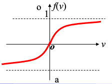

#### 6.4.2. 神经网络拓扑

径向基（RBF）神经网络：

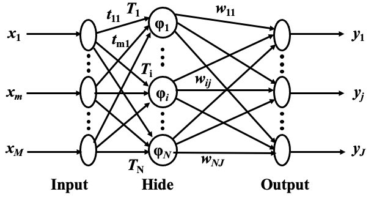


Hopfield反馈神经网络：

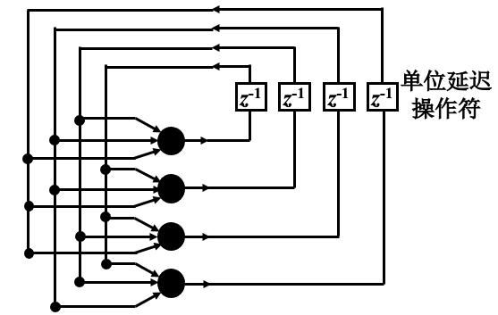

卷积神经网络：

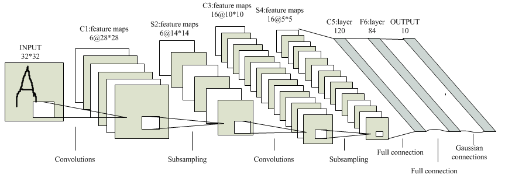


### 习题

选取得到的150条二手房数据，**90%数据用作训练**，**10%数据用作测试**。要求**打印出测试结果**，并**画出训练好的房价预测函数（模型）图**。

提示：

```python
# 导入库
import numpy as np
from matplotlib import pyplot as plt
```

```python
# 加载数据
def load_data():
    data = np.loadtxt('price_area.txt', delimiter=None)
    X = data[:,1]
    Y = data[:,0]
    data = [X, Y]
    return data
```

```python
# 计算样本误差和梯度
def compute_cost_and_gradients(X, Y, W, b):
    Z = W * X - b
    dZ = (Z - Y)
    m = X.size
    cost = np.sum(dZ * dZ)/(2 * m)   #误差，方差
    dw = np.dot(X, dZ.T)/m			 #dot为矩阵运算方法，.T为转置函数
    db = np.sum(dZ)/m
    cost = np.squeeze(cost)
    grads = {
        "dw": dw,
        "db": db
    }
    return grads, cost
```

```python
# 更新模型参数
def update_parameters(X, Y, w, b, learning_rate):
    grads, cost = compute_cost_and_gradients(X, Y, w, b)
    dw = grads['dw']
    db = grads['db']
    w = w - learning_rate * dw
    b = b - learning_rate * db
    return w, b, cost
```

```python
# 训练模型
def train(X, Y, w, b, iteration_nums, learning_rate):
    costs = []
    for i in range(iteration_nums):
        w, b, cost = update_parameters(X, Y, w, b, learning_rate)
        if i % 10 == 0:
            costs.append(cost)
            print("Iteration %d, cost %f" % (i, cost))
    print("w: %f" % w)
    print("b: %f" % b)
    return costs, w, b
```

```python
# 画出样本误差变化图
def plot_costs(costs, learning_rate):
    plt.plot(costs)
    plt.ylabel('cost')
    plt.xlabel('Iterations (per 10)')
    plt.title('learning rate =' + str(learning_rate))
    plt.show()
```

```python
# 画出房价预测模型图
def plot_model(X_train, Y_train, w, b):
    fig = plt.figure()
    ax = plt.subplot()
    ax.scatter(X_train, Y_train)
    x = X_train
    y = w*x+b
    ax.plot(x, y, c='orange')
    plt.ylabel('House Price')
    plt.xlabel('House Area')
    plt.title('House Price Distribution and Prediction')
    plt.show()
```

