# 数字图像处理

本课程是图像处理的入门课程，用案例与任务形式来驱动读者进行数字图像处理相关的学习，以满足职业教育、应用型人才的发展要求。


## 第6章 云端应用


### 课程目录

6.1. 优图SDK安装

6.2. 手势识别操作

6.3. 图像内容识别操作

6.4. 手写字符识别操作

6.5. 速算题目识别操作

6.6. 名片识别操作

6.7. 上位机开发


### 6.1. 优图SDK安装

#### 知识准备

​    优图SDK是一个典型的互联网上调用现成人工智能功能的云端软件开发工具包，包含了丰富的机器视觉识别功能。基于此工具包，可无需训练模型与调整参数，即可实现多种机器视觉应用。本节主要任务是在windows环境安装优图SDK。安装优图SDK需要已安装Python开发环境，并且需要安装Requests库与git工具。通过git工具来进一步安装优图SDK。

#### 安装步骤

**第一步**，首先确保您已经安装了Python和pip，可参考本书第1章内容。在windows用户界面下同时按下Windows键+R键，并输入CMD可进入命令窗口。在命令窗口下使用pip命令安装Requests库，如图6-1-1所示。

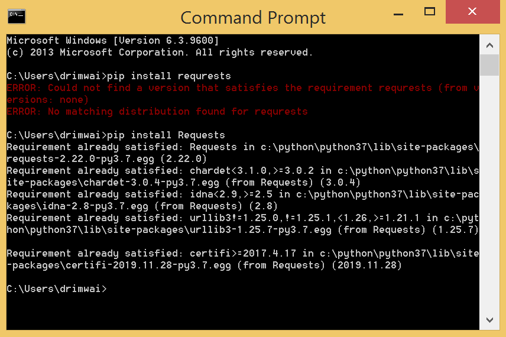

<center>图6-1-1 安装Requests库</center>

**第二步**，在 https://git-scm.com/download/win 网址下载git工具并安装。打开安装好的Git Bash进入其命令窗口，如图6-1-2所示。并执行如下命令：

```bash
cd c:
ls
cd Python/
cd Python37/
```

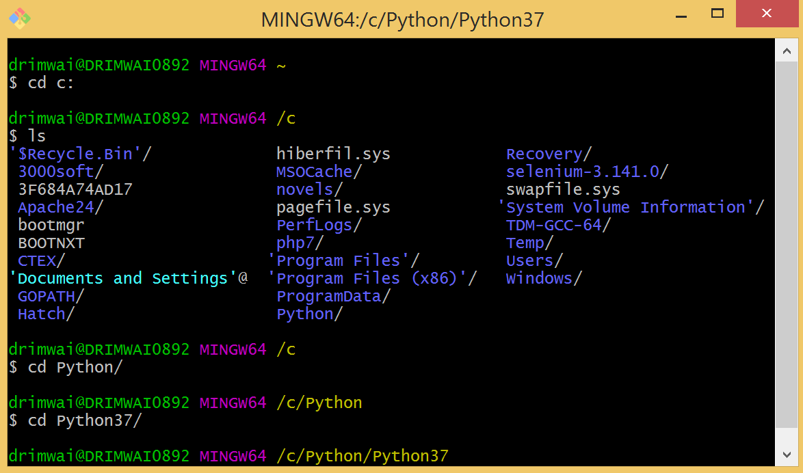

<center>图6-1-2 执行进入文件目录命令</center>

**第三步**，在Git Bash命令提示符窗口下，执行优图Python SDK下载命令 `git clone https://github.com/Tencent-YouTu/Python_sdk`。执行过程中需要注册与登录github账号，注册地址：https://open.youtu.qq.com/#/open/developer/join，如图6-1-3所示：

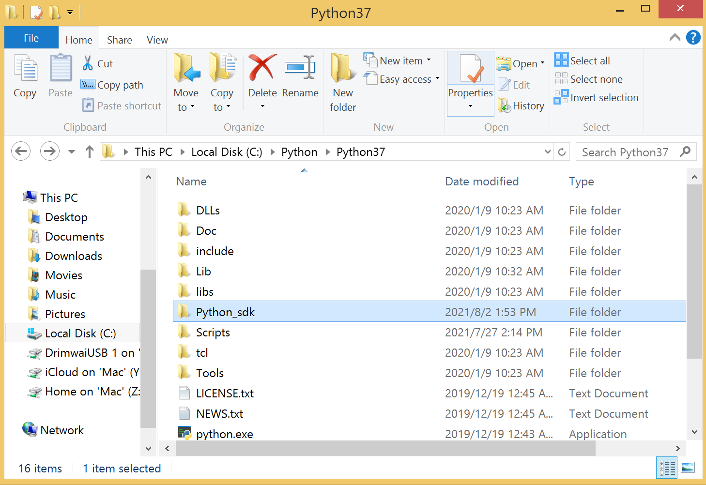

<center>图6-1-3 优图SDK安装目录</center>

**如果第二/三步不成功**，可以选择 https://github.com/Tencent-YouTu/Python_sdk 下载安装包，拷贝到python目录下，使用 `pip install Python_sdk-master.zip` 命令进行安装。**安装完成后，TencentYoutuyun目录被安装在 ../Python37/Lib/site-packages 目录下。**

**第四步**，安装完成后，由于优图Python SDK是基于Python 2.x写的，在Python 3.x下要稍作修改优图Python SDK以兼容Python 3.x环境。打开Python_sdk文件目录下\_\_init\_\_.py文件，如图6-1-4所示：

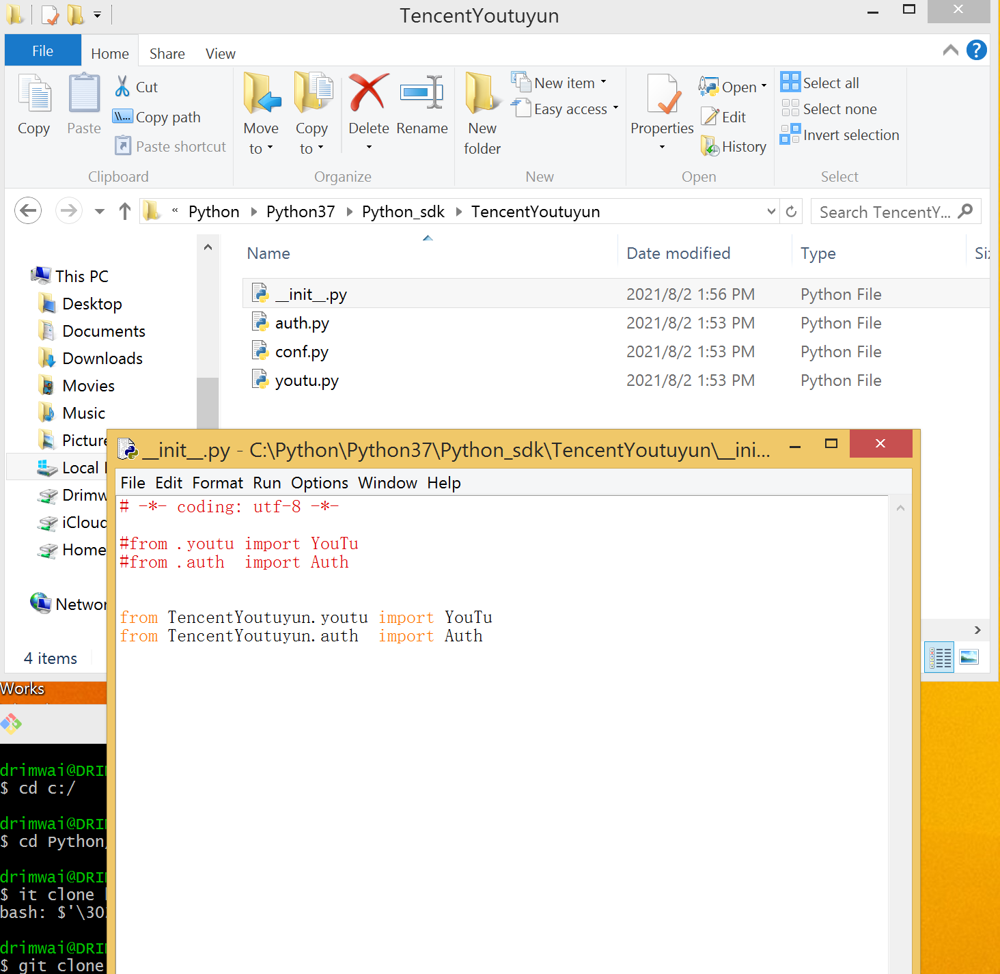

<center>图6-1-4 优图SDK安装目录</center>

**第五步**，把youth.py脚本文件中的所有print都改成print()，如图6-1-5所示：

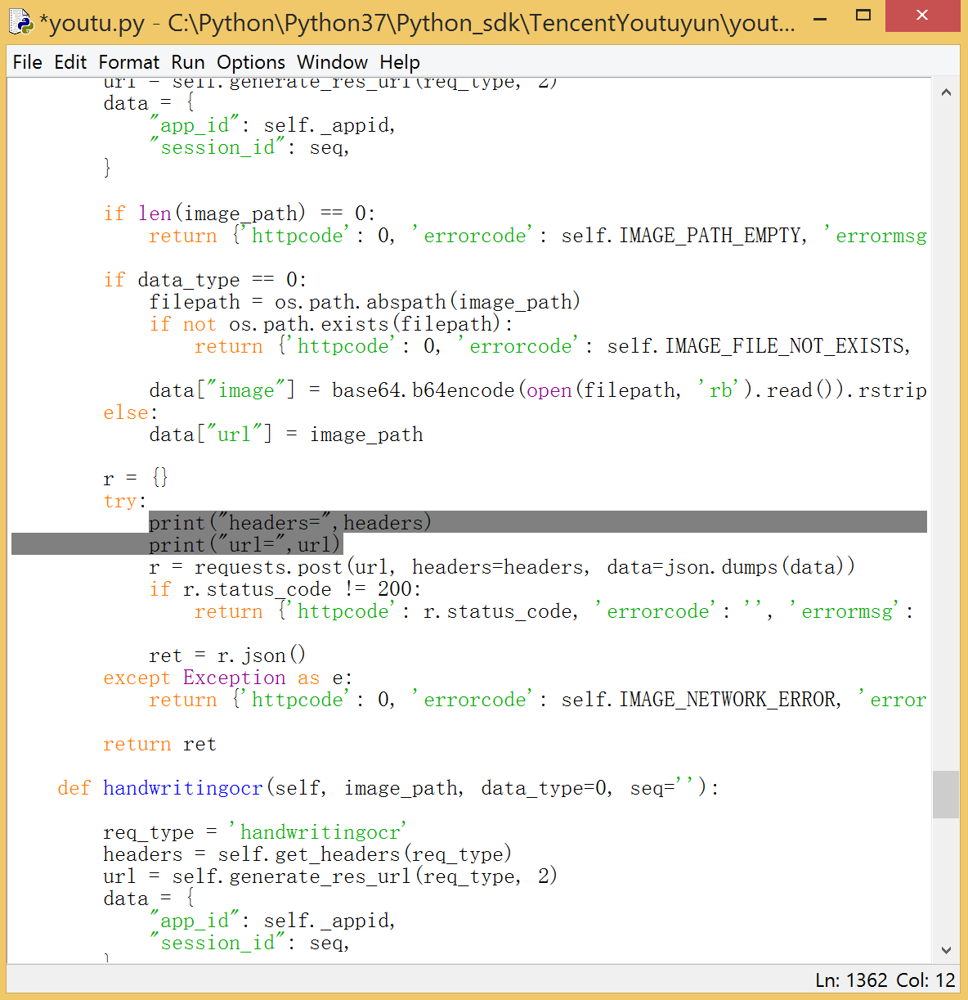

<center>图6-1-5 优图SDK安装目录</center>

#### 课后习题

1. 互联网上有哪些公司提供可直接调用的机器视觉接口？分别都有哪些功能？

   阿里、腾讯、百度、谷歌等等；有人脸识别、手势识别、图像识别等功能。

2. 调用互联网上的接口是否需要联网？如何用代码检测网络是否正常？

   需要；如果只需要检测网络是否正常，可以在cmd窗口ping任意一个网站，网络正常则会返回正常网速等信息。

3. Python 2.x与Python3.x版本，在打印函数上有什么区别？

   ```
   1
   2.X: print “The answer is”, 2*2
   3.X: print(“The answer is”, 2*2)
   2
   2.X: print x, # 使用逗号结尾禁止换行
   3.X: print(x, end=” “) # 使用空格代替换行
   3
   2.X: print # 输出新行
   3.X: print() # 输出新行
   4
   2.X: print >>sys.stderr, “fatal error”
   3.X: print(“fatal error”, file=sys.stderr)
   5
   2.X: print (x, y) # 输出repr((x, y))
   3.X: print((x, y)) # 不同于print(x, y)!
   ```

   


### 6.2. 手势识别操作

- 本节任务

​    人类之间的交流，除了语言和文字外，还常常使用手势。比如胜利的手势、比心的手势、剪刀石头布、点赞的手势等等。手势可以用来表示一种态度，也可以传递一种信息。在很多新型的游戏机或VR应用里，已经应用手势识别，通过不同的手势表示不同的操作命令。在辅助驾驶或自动驾驶领域，已开始将手势识别实现在车载设备中，驾驶员或乘客可以手势交互实现如播接挂电话、调节音量、选择歌曲、控制导航、控制车辆等功能。本节的主要任务是理解优图SDK调用方法与返回数据格式，并仿照示例编写代码实现手势识别功能并解析返回的数据。

- 接口介绍

1. 接口地址： http://api.youtu.qq.com/youtu/handtracking/classify
2. 请求方式：HTTP POST
3. 请求内容：

​    手势识别接口需要向服务器发送4个参数，其中app_id是注册优图服务时生成的，image是图像的二进制数据（可有SDK自动生成），url可以是图像的网络地址，如表6-2-1所示。

<center>表6-2-1 手势识别接口请求内容</center>

| 参数名称   | 必选 | 类型          | 描述                            |
| ---------- | ---- | ------------- | ------------------------------- |
| app_id     | 是   | String        | App的AppID                      |
| image      | 否   | String(Bytes) | base64编码的二进制图像数据      |
| url        | 否   | String        | 图像的url，image和URL只提供一个 |
| session_id | 否   | String        | 会话号，可为空                  |

4. 返回内容

​    手势识别接口请求成功后，服务器会返回四个参数，其中errorcode是错误码，如无错误为0，items是一个结构数据包含了更多的识别结果参数，classify_cnt是图像中包含的手势数量，如表6-2-2所示。

<center>表6-2-2 手势识别接口返回内容</center>

| 字段         | 类型   | 描述               |
| ------------ | ------ | ------------------ |
| errorcode    | Int32  | 返回码             |
| errormsg     | String | 返回错误消息       |
| items        | Array  | 识别结果           |
| classify_cnt | Int32  | 成功识别的手势数量 |

​    其中items结构如表6-2-3所示：

<center>表6-2-3 items所包含的参数</center>

| 字段       | 类型   | 描述                                                         |
| ---------- | ------ | ------------------------------------------------------------ |
| label      | String | 类型标签 {<br />Heart: 比心；<br />Paper: 布；<br />Scissor: 剪刀；<br />。。。} |
| confidence | float  | 置信度                                                       |
| X          | Int32  | 识别内容左上角X                                              |
| Y          | Int32  | 识别内容左上角Y                                              |
| height     | Int32  | 识别内容的高度                                               |
| width      | Int32  | 识别内容的宽度                                               |

- 执行代码

```python
#coding: utf-8
import time
import urllib.request as request
import numpy as np
import cv2 as cv
import TencentYoutuyun
#提供接口必要信息
appid = '10216798'
secret_id = 'AKIDFZifnlK9btzGLDPZ1QTM3Y3RhlcJ78JI'
secret_key = 'yYwDKFyCtQQFsLbgZGm68zgBUbWGtKYe'
userid = 'xxxxxx'
end_point = TencentYoutuyun.conf.API_YOUTU_END_POINT
youtu = TencentYoutuyun.YouTu(appid, secret_id, secret_key, userid, end_point)
session_id = ''
#调用优图手势识别API，以获取识别结果
image_address = 'https://img1.jiemian.com/101/original/20141119/141638675074705000_a700xH.jpg'
ret = youtu.hposeclassify(image_address, data_type = 0, seq = '')
print(ret)
print(ret['items'][0]['label'])
#读取手势并显示
response = request.urlopen(image_address)
img_array = np.array(bytearray(response.read()), dtype=np.uint8)
img = cv.imdecode(img_array, -1)
x = ret['items'][0]['x']
y = ret['items'][0]['y']
h = ret['items'][0]['height']
w = ret['items'][0]['width']
draw_0 = cv.rectangle(img, (x, y), (w, h), (255, 0, 0), 2)
cv.imshow('Gesture', draw_0)
```

- youtu.py下添加如下代码

```python
#定一个新的识别函数
def hposeclassify(self, image_path, data_type = 0, seq = ''):
  #获取接口相关信息
  req_type = 'classify'
  headers = self.get_headers(req_type)
  url = 'http://api.youtu.qq.com/youtu/handtracking/classify'
  print(url)
  data = {
    'app_id': self._appid,
    'seq': seq
  }
  #判断图片路径是否合法
  if len(image_path) == 0:
    return {'httpcode': 0, 'errorcode': self.IMAGE_PATH_EMPTY, 'errormsg': 'IMAGE_PATH_EMPTY'}
  else:
    data['url'] = image_path
    #初始化返回数据
    r = {}
    #调用优图手势识别API并获取返回结果
    try:
      r = requests.post(url, headers = headers, data = json.dumps(data))
      print(url)
      print(headers)
      print(data)
      if r.status_code != 200:
        return {'httpcode': r.status_code, 'errorcode': '', 'errormsg': ''}
      r.encoding = 'unicode'
      ret = r.json()
    except Exception as e:
      return {'httpcode': 0, 'errorcode':self.IMAGE_NETWORK_ERROR, 'errormsg':str(e)}
  return ret
```

- 执行效果

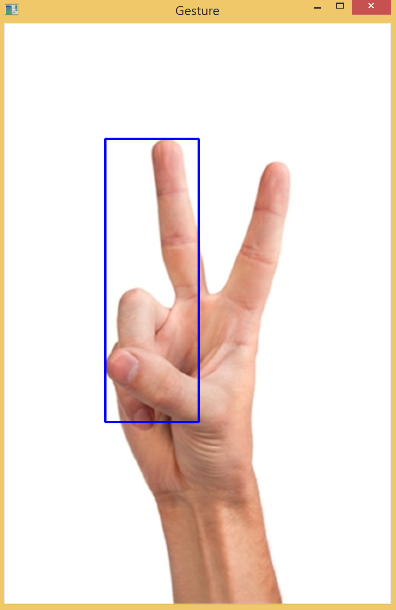

<center>图6-2-1 剪刀手势识别结果</center>

- 习题

1. 本节中的手势识别接口，可以识别哪一些手势？

   

2. 手势识别可以应用在哪些行业、哪些场景？

   可以应用在聋哑人爱心服务行业。
   场景：和聋哑人交流

3. 如何解析手势识别接口返回的json数据？

   

4. 拍摄不同手势的图像，调用接口，并解析返回的数据。

   

5. 拍摄一张包含两个以上手势的图像，调用接口，观察并解析返回的数据。


### 6.3. 图像内容识别

- 本节任务

​    一幅图像里面包含的信息是丰富多彩的，例如一幅乡间风景图，可能有乡间小道、树木、草地、农作物、鸡鸭狗、农夫、牛、农具等等。在许多行业，均需要对现场环境内所采集到的图像进行分析，以获取相应的信息，这就需要进行图像内容识别。设定需要搜索的内容，可以在成千上万的图像中，通过采用图像内容识别自动计算找到一张或多张包含所需搜索内容的图像，替代人工一张张肉眼查看的工作。本节的主要任务是理解优图SDK调用方法与返回数据格式，仿照示例实现图像内容识别代码、解析返回数据格式内容。

- 接口介绍

1. 地址：http://api.youtu.qq.com/youtu/imageapi/imagetag
2. 请求方式：HTTP POST
3. 请求内容：

<center>表6-3-1 图像识别接口请求内容</center>

| 参数名称   | 必选 | 类型          | 描述                            |
| ---------- | ---- | ------------- | ------------------------------- |
| app_id     | 是   | String        | App的AppID                      |
| image      | 否   | String(Bytes) | base64编码的二进制图像数据      |
| url        | 否   | String        | 图像的url，image和URL只提供一个 |
| session_id | 否   | String        | 会话号，可为空                  |

4. 返回内容：

​    接口请求后返回内容包含三个参数，其中errorcode为0表示调用成功，tags是图像内容识别的结果数据，如表 6-3-2所：

<center>表6-3-2 图像识别接口返回内容</center>

| 字段      | 类型      | 描述                    |
| --------- | --------- | ----------------------- |
| errorcode | Int32     | 返回状态码，非0值为出错 |
| errormsg  | String    | 返回错误描述            |
| tags      | ImageTage | 图像的分类标签          |

其中tags结构如表6-3-3所示，包含了识别的名称、置信度：

<center>表6-3-3 tags属性所包含的参数内容</center>

| 字段           | 类型   | 描述                                            |
| -------------- | ------ | ----------------------------------------------- |
| tag_name       | String | 返回图像内容的名字                              |
| tag_confidence | Int    | 图像内容的置信度，整型范围0-100，越大置信度越高 |

- 代码

```python
#encoding: utf-8
import time
import TencentYoutuyun
import cv2 as cv
import numpy as np
#提供接口必要信息
appid = '10216798'
secret_id = 'AKIDFZifnlK9btzGLDPZ1QTM3Y3RhlcJ78JI'
secret_key = 'yYwDKFyCtQQFsLbgZGm68zgBUbWGtKYe'
userid = 'xxxxxx'
end_point = TencentYoutuyun.conf.API_YOUTU_END_POINT
youtu = TencentYoutuyun.YouTu(appid, secret_id, secret_key, userid, end_point)
session_id = ''
#输入图像以获取识别结果
img = cv.imread('image-7-1.png')
cv.imshow('target image',img)
ret = youtu.imagetag('image-7-1.png', data_type = 0, seq = '')
text = ''
for i in range(len(ret['tags'])):
    ret_type = ret['tags'][i]['tag_name'].encode('raw_unicode_escape').decode()
    text = 'tag_name = '+ ret_type + '  tag_confidence = ' + str(ret['tags'][i]['tag_confidence'])
    print(text)
```

- 执行效果

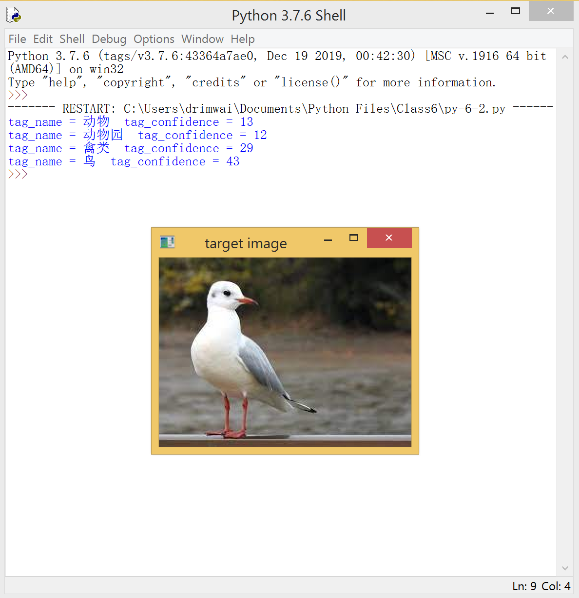

<center>图6-3-1 图像内容识别效果</center>

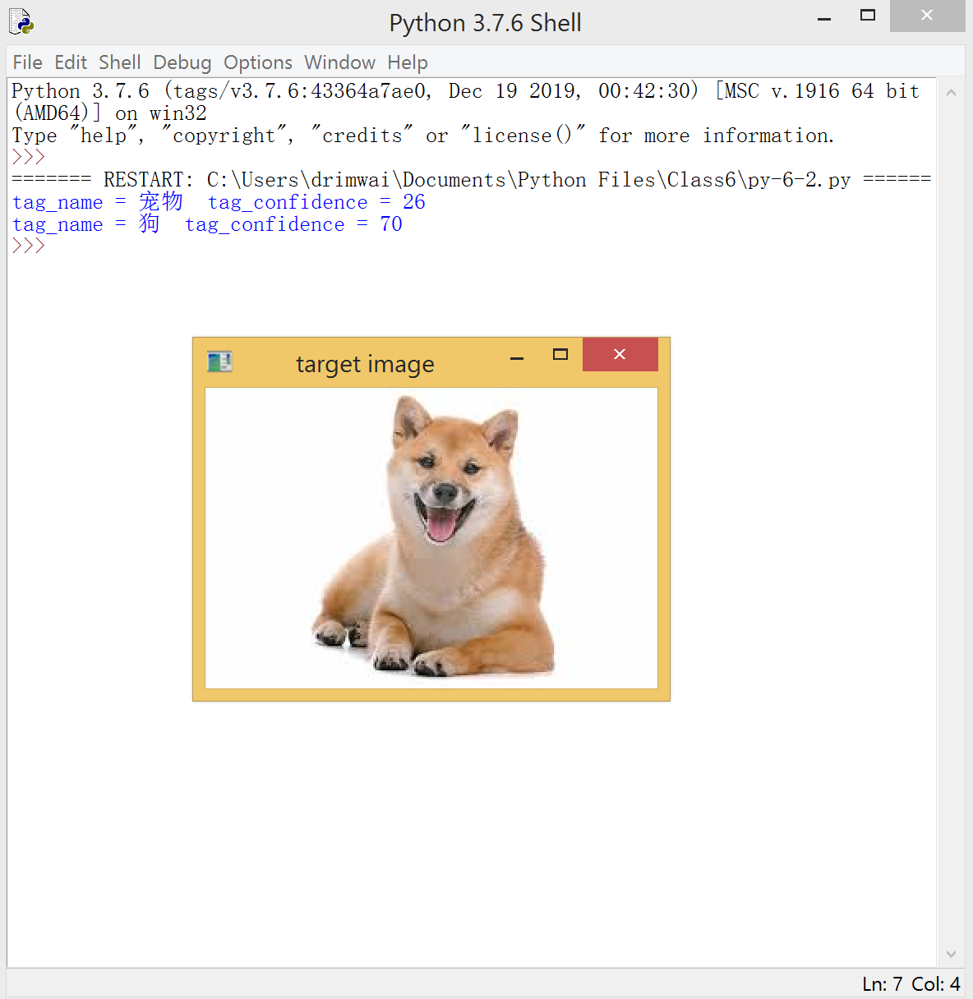

<center>图6-3-2 图像内容识别效果</center>

- 习题

1. 本节中的图像内容接口，可以识别哪一些图像类型？
2. 图像内容识别可以应用在哪些行业、哪些场景？
3. 如何解析图像内容识别接口返回的json数据？
4. 拍摄不同物体的图像（如动物、汽车、书本、美食等），调用接口，并解析返回的数据。
5. 拍摄一张包含两个以上不同物体的图像，调用接口，观察并解析返回的数据。


### 6.4. 手写字符识别操作

- 本节任务

​    目前工作生活中，仍少不了手写记录环节，例如财务会计单据、会议纪要、课程笔记、银行存取款填单都有可能需要手写。为了将手写的文字、字符转化成电子文档，就需要用到手写字符识别功能。手写的字符主要包括中文、英文、阿拉伯数字以及其他相关字符，本节的主要任务是能理解优图SDK调用方法、返回数据格式，仿照示例实现手写字符识别代码、解析返回数据格式内容。

- 接口介绍

1. 接口地址：https://api.youtu.qq.com/youtu/ocrapi/handwritingocr
2. 请求方式：HTTP POST
3. 请求内容：

<center>表6-4-1 图像识别接口请求内容</center>

| 参数名称   | 必选 | 类型          | 描述                            |
| ---------- | ---- | ------------- | ------------------------------- |
| app_id     | 是   | String        | App的AppID                      |
| image      | 否   | String(Bytes) | base64编码的二进制图像数据      |
| url        | 否   | String        | 图像的url，image和URL只提供一个 |
| session_id | 否   | String        | 会话号，可为空                  |

4. 返回内容：

<center>表6-4-2 图像识别接口返回内容</center>

| 字段       | 类型   | 描述                                                         |
| ---------- | ------ | ------------------------------------------------------------ |
| angle      | Float  | 图像旋转角度（角度制），手写字符文本的水平方向为$0^o$​；顺时针为正，逆时针为负 |
| errorcode  | Int32  | 错误码                                                       |
| errormsg   | String | 错误码消息                                                   |
| session_id | String | 相应请求的session标识符，可用于结果查询                      |
| items      | Array  | 识别结果                                                     |

<center>表6-4-3 items属性所包含的参数内容</center>

| 字段           | 类型   | 描述                                                         |
| -------------- | ------ | ------------------------------------------------------------ |
| itemstring     | String | 识别出的文本行字符串                                         |
| coordpoint     | Array  | 文本行在原图中的四点坐标                                     |
| itemconf       | Float  | 文本行置信度                                                 |
| parag          | Object | 识别出来的文本行段落信息，包括段落编号parag_no，以及字体大小word_size |
| itemcoord      | Object | 文本行在旋转纠正之后的图像中的像素坐标，表示为（左上角x，左上角y，宽w，高h） |
| words          | Array  | 识别出来的单字信息包括单子（包括单字符Character和单字置信度confidence） |
| coords         | Array  | 单字符在旋转纠正之后的图像中的像素坐标，表示为（左上角x，左上角y，宽w，高h） |
| candword       | Array  | 候选字符集（包括候选字符Character以及置信度confidence）      |
| wordcoordpoint | Array  | 单字在原图中的四点坐标                                       |

- 代码

```python
#encoding: utf-8
import time
import TencentYoutuyun
import cv2 as cv
import numpy as np
#提供接口必要信息
appid = '10216798'
secret_id = 'AKIDFZifnlK9btzGLDPZ1QTM3Y3RhlcJ78JI'
secret_key = 'yYwDKFyCtQQFsLbgZGm68zgBUbWGtKYe'
userid = 'xxxxxx'
end_point = TencentYoutuyun.conf.API_YOUTU_END_POINT
youtu = TencentYoutuyun.YouTu(appid, secret_id, secret_key, userid, end_point)
session_id = ''
#手写字符识别
handwritingocr = youtu.handwritingocr('image-7-3.png', data_type = 0)
print('返回数据'， handwritingocr)
length = len(handwritingocr['items'])
print('识别结果如下：')
for i in range(o, length):
  print(handwritingocr['items'][i]['itemstring'])
image = cv.imread('image-7-3.png')
cv.imshow('hand written recognition', image)
```

- 执行效果

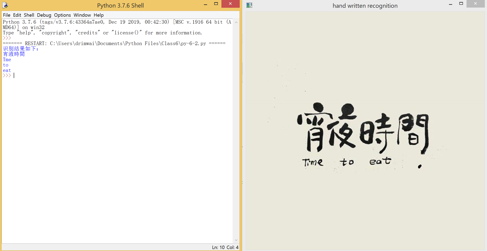

<center>图6-4-1 手写内容识别效果</center>

- 习题

1. 本节中的手写字符识别接口，可以识别哪些语言的字符？

   支持多场景、任意版面下整图文字的识别。支持自动识别语言类型，同时支持自选语言种类（推荐），除中英文外，支持日语、韩语、西班牙语、法语、德语、葡萄牙语、越南语、马来语、俄语、意大利语、荷兰语、瑞典语、芬兰语、丹麦语、挪威语、匈牙利语、泰语等多种语言。

2. 手写字符识别可以应用在哪些行业、哪些场景？

   应用场景包括：印刷文档识别、网络图片识别、广告图文字识别、街景店招识别、菜单识别、视频标题识别、头像文字识别等。

3. 如何解析手写字符识别接口返回的json数据？

   返回值说明

   a. 返回主体包的内容

   | 字段           | 是否必然返回 | 类型   | 说明                                                         |
   | -------------- | ------------ | ------ | ------------------------------------------------------------ |
   | angle          | 是           | Float  | 图片旋转角度（角度制），文本的水平方向为0°；顺时针为正，逆时针为负 |
   | errorcode      | 是           | Int32  | 错误码                                                       |
   | errormsg       | 是           | String | 错误码消息                                                   |
   | session_id     | 否           | String | 相应请求的session标识符，可用于结果查询                      |
   | items          |              |        |                                                              |
   | itemstring     | 是           | String | 识别出的文本行字符串                                         |
   | coordpoint     | 是           | Object | 文本行在原图中的四点坐标                                     |
   | itemconf       | 是           | Float  | 文本行置信度                                                 |
   | parag          | 是           | Object | 识别出来的文本行段落信息，包括段落编号parag_no，以及字体大小word_size |
   | itemcoord      | 是           | Object | 文本行在旋转纠正之后的图像中的像素坐标，表示为（左上角x, 左上角y，宽width，高height） |
   | words          | 是           | Array  | 识别出来的单字信息包括单字（包括单字Character和单字置信度confidence） |
   | coords         | 否           | Array  | 单字在旋转纠正之后的图像中的像素坐标，表示为（左上角x, 左上角y，宽width，高height） |
   | candword       | 否           | Array  | 候选字符集（包含候选字Character以及置信度Confidence）        |
   | wordcoordpoint | 否           | Array  | 单字在原图中的四点坐标                                       |

4. 拍摄不同语言的手写字符（如阿拉伯数字、英文、中文等），调用接口，并解析返回的数据。

   

   

   

5. 拍摄一张包含两种不同手写语言的图像，调用接口，观察并解析返回的数据。

   ```
   
   识别结果如下：
   朋友,Hellow,welcome
   to
   my
   world
   ```

   

### 6.5. 速算题目识别

- 本节任务

​    速算指寻找并使用数的特殊关系或规律进行快速运算。在教育行业，尤其是中小学教育，速算是热门的课程内容。而批改速算作业或验证速算结果，对于老师和家长是比较繁重的工作，而学生也需要一个快速验证结果的工具，以达到边速算边验证的自我练习效果。这就需要用到速算题目识别功能。本节的主要任务是理解优图SDK调用方法、返回数据格式，仿照示例速算题目识别代码、解析返回数据格式内容。速算题目识别可识别的运算包括：加减乘除四则运算、分数四则运算、竖式四则运算与脱式计算。读者可以利用该功能实现小学生学习工具、在线答题小游戏等创新应用。

- 接口介绍

1. 接口地址：https://api.youtu.qq.com/youtu/ocrapi/arithmeticocr
2. 请求方式：HTTP POST
3. 请求内容：

<center>表6-5-1 图像识别接口请求内容</center>

| 参数名称   | 必选 | 类型          | 描述                            |
| ---------- | ---- | ------------- | ------------------------------- |
| app_id     | 是   | String        | App的AppID                      |
| image      | 否   | String(Bytes) | base64编码的二进制图像数据      |
| url        | 否   | String        | 图像的url，image和URL只提供一个 |
| session_id | 否   | String        | 会话号，可为空                  |

4. 返回内容：

| 字段            | 类型   | 描述                                                         |
| --------------- | ------ | ------------------------------------------------------------ |
| angle           | Float  | 速算题目的角度（90度或270度）                                |
| errorcode       | Int32  | 错误码                                                       |
| errormsg        | String | 错误码消息                                                   |
| session_id      | String | 相应请求的session标识符，可用于结果查询                      |
| items           | Array  | 识别结果                                                     |
| item            | String | 算是运算结果：<br />‘Yes’: 正确<br />‘No’: 错误<br />‘NA’: 非法参数 |
| itemstring      | String | 识别出的文本行字符串                                         |
| itemconf        | Float  | 文本行置信度                                                 |
| itemcoord       | Object | 文本行在旋转纠正之后的图像中的像素坐标，表示为（左上角x，左上角y，宽w，高h） |
| answer          | String | 错题推荐答案，算式运算结果正确返回 “”，结果错误时返回推荐答案 |
| Expression_type | String | 算式题型编号:<br />‘1’：加减乘除四则<br />‘2’：加减乘除已知结果求运算因子<br />‘3’：判断大小<br />‘4’：约等于估算<br />'5'：带余数除法<br />'6'：分数四则运算<br />'7'：单位转换<br />'8'：竖式加减法<br />‘9’：竖式乘除法<br />‘10’：脱式计算<br />‘11’：解方程 |

- 代码

```python
#encoding: utf-8
import time
import TencentYoutuyun
import cv2 as cv
#提供接口必要信息
appid = '10216798'
secret_id = 'AKIDFZifnlK9btzGLDPZ1QTM3Y3RhlcJ78JI'
secret_key = 'yYwDKFyCtQQFsLbgZGm68zgBUbWGtKYe'
userid = 'xxxxxx'
end_point = TencentYoutuyun.conf.API_YOUTU_END_POINT
youtu = TencentYoutuyun.YouTu(appid, secret_id, secret_key, userid, end_point)
session_id = ''
#速算题目识别
arithmeticocr = youtu.arithmeticocr('image-7-4.png', data_type = 0)
print('返回数据：', arithmeticocr)
print('题目：', arithmeticocr['items'][0]['itemstring'])
print('答案：', arithmeticocr['items'][0]['answer'])
image = cv.imread('image-7-4.png')
cv.imshow('arithmetic recognition', image)
```

- 执行效果

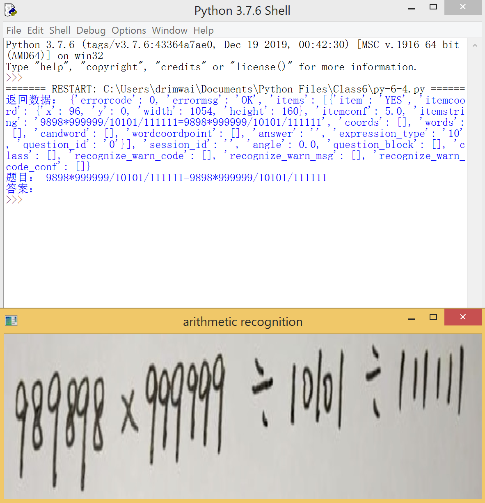

<center>图6-5-1 速算题目识别效果</center>

- 习题

1. 本节中的速算题目识别接口，可以识别哪些类型的速算题目？

   包括加减乘除四则运算、分数四则运算、竖式四则运算、脱式计算等。

2. 速算题目识别可以应用在哪些行业、哪些场景？

   教育行业。

   可以用在父母、老师替学生检查作业场景。

3. 如何解析速算题目识别接口返回的json数据？

   a. 返回主体包的内容

   | 字段            | 是否必然返回 | 类型   | 说明                                                         |
   | --------------- | ------------ | ------ | ------------------------------------------------------------ |
   | angle           | 是           | Float  | 图片横屏的角度(90度或270度)                                  |
   | errorcode       | 是           | Int32  | 错误码                                                       |
   | errormsg        | 是           | String | 错误码消息                                                   |
   | session_id      | 否           | String | 相应请求的session标识符，可用于结果查询                      |
   | items           |              |        |                                                              |
   | item            | 是           | String | 算式运算结果: ‘YES’:正确 ‘NO’: 错误 ‘NA’: 非法参数           |
   | itemstring      | 是           | String | 识别出的文本行字符串                                         |
   | itemconf        | 是           | Float  | 文本行置信度                                                 |
   | itemcoord       | 是           | Object | 文本行在旋转纠正之后的图像中的像素坐标，表示为（左上角x, 左上角y，宽width，高height） |
   | answer          | 是           | String | 错题推荐答案，算式运算结果正确返回为""，算式运算结果错误返回推荐答案 (注：暂不支持多个关系运算符（如1<10<7）、无关系运算符（如frac(1,2)+frac(2,3)）、单位换算（如1元=100角）错题的推荐答案返回) |
   | expression_type | 是           | String | 算式题型编号： ‘1’: 加减乘除四则 ‘2’: 加减乘除已知结果求运算因子 ‘3’: 判断大小 ‘4’: 约等于估算 ‘5’: 带余数除法 ‘6’: 分数四则运算 ‘7’: 单位换算 ‘8’: 竖式加减法 ‘9’: 竖式乘除法 ‘10’: 脱式计算 ‘11’: 解方程 |
   | question_id     | 是           | String | 用于标识题目id，如果有若干算式属于同一题，则其对应的id相同   |

4. 拍摄不同速算题目，调用接口，并解析返回的数据。

   代码每天运行次数有限，不能运行。

5. 拍摄一张包含两个以上速算题目的图像，调用接口，观察并解析返回的数据。

   代码每天运行次数有限，不能运行。


### 6.6. 名片识别

- 本节任务

​    在实际工作中，往往商务交往需要交换名片，而纸质名片经常会丢失。丢失的结果有可能导致失去重要的客户。如果能采用图像识别的方法，对所拍照的名片图像进行识别，获取客户的重要信息形成电子记录，这样就能够及时保存客户信息并不会因为纸质名片的保存而操心。

​    名片上主要是字符信息与图案信息。因此，可以采用字符识别的方式来对名片信息进行识别。调用腾讯优图实验室的名片识别云端接口，并修改配置SDK中名片识别的参数以获取名片中的LOGO图案。通过解析调用接口后的返回数据，可以获得名片中的重要信息，并保存与显示公司LOGO图案。

- 接口介绍

1. 接口地址：https://api.youtu.qq.com/youtu/ocrapi/bcocr
2. 请求方式：HTTP POST
3. 请求内容：

<center>表6-6-1 名片识别接口请求内容</center>

| 参数名称    | 必选 | 类型          | 描述                                                         |
| ----------- | ---- | ------------- | ------------------------------------------------------------ |
| app_id      | 是   | String        | App的AppID                                                   |
| image       | 否   | String(Bytes) | base64编码的二进制图像数据                                   |
| url         | 否   | String        | 图像的url，image和URL只提供一个                              |
| session_id  | 否   | String        | 会话号，可为空                                               |
| preprocess  | 否   | Bool          | 预处理开关，功能是检测图像倾斜角度，将原本倾斜的图像转正。可为空 |
| rotate_90   | 否   | Bool          | 旋转开关，主要是在图像检测和识别前，对颠倒的图像进行90度旋转，便于检测和识别 |
| rotate_180  | 否   | Bool          | 旋转开关，主要是在图像检测和识别前，对颠倒的图像进行180度旋转，便于检测和识别 |
| logo_detect | 否   | Bool          | logo开关，打开可返回名片上的logo图像数据（使用base64加密后的字符串），需要和ret_image配合使用，便于检测和识别 |
| Ret_image   | 否   | Bool          | 默认为空，ret_image的取值如下：<br />preprocess：返回预处理后的图像；<br />logo：返回logo图像；<br />origin：返回原图图像；<br />“ ”：不返回图像数据。 |

4. 返回内容：

​    名片识别接口成功调用后返回内容如表6-2-2所示。包括错误码，识别结果等内容。

<center>表6-6-2 手势识别接口返回内容</center>

| 字段       | 类型   | 描述                                           |
| ---------- | ------ | ---------------------------------------------- |
| angle      | Float  | 名片识别的角度（90度或270度）                  |
| errorcode  | Int32  | 返回码                                         |
| errormsg   | String | 返回错误消息                                   |
| session_id | String | 相应请求的session标识符，可用于结果查询        |
| items      | Array  | 识别结果                                       |
| image      | String | 返回名片的图像数据（使用base64加密后的字符串） |

​    其中items结构如表6-6-3所示：

<center>表6-6-3 items所包含的参数</center>

| 字段       | 类型   | 描述                                                         |
| ---------- | ------ | ------------------------------------------------------------ |
| item       | String | 识别出的字段名称（关键字），支持以下字段：姓名、电话、手机、邮箱、公司、职位、网址、地址、QQ、微信、MSN |
| itemstring | String | 识别出的字段名称对应的值，也就是字段item对应的字符串结果     |
| itemconf   | Float  | 文本行置信度                                                 |
| itemcoord  | Object | 文本行在旋转纠正之后的图像中的像素坐标，表示为（左上角x，左上角y，宽w，高h） |
| words      | Array  | 识别内容的单字信息，包括：单字Character和单子置信度condidence |

- 代码

```python
#encoding: utf-8
import time
import TencentYoutuyun
import cv2 as cv
import os
import base64
import sys
#提供接口必要信息
appid = '10216798'
secret_id = 'AKIDFZifnlK9btzGLDPZ1QTM3Y3RhlcJ78JI'
secret_key = 'yYwDKFyCtQQFsLbgZGm68zgBUbWGtKYe'
userid = 'xxxxxx'
end_point = TencentYoutuyun.conf.API_YOUTU_END_POINT
youtu = TencentYoutuyun.YouTu(appid, secret_id, secret_key, userid, end_point)
session_id = ''
#名片识别
retbcocr = youtu.bcocr('image-7-5.png',data_type = 0)
length = len(retbcocr['items'])
print('识别结果如下：')
for i in range(0, length-1):
  print(retbcocr['items'][i]['item'], '', retbcocr['items'][i]['itemstring'])
#获取公司LOGO图像并解码
strs = retbcocr['image']
img = base64.b64decode(strs)
#保存公司LOGO图像
file = open('logo.jpg', 'wb')
file.write(img)
file.close()
#显示公司LOGO图像
img2 = cv.imread('logo.jpg', 1)
cv.imshow('logo', img2)
```

- SDK代码修改

```python
def bcocr(self, image_path, data_type = 0, seq = ''):

  req_type = 'bcocr'
  headers = self.get_headers(req_type)
  url = self.generate_res_url(req_type, 2)
  data = {
    "app_id": self._appid,
    "session_id": seq,
    #添加logo显示选项
    "options":
  	  {
   	   "logo_detect": True,
  	   "ret_image": "logo"
  	  }
  }

  if len(image_path) == 0:
    return {'httpcode':0, 'errorcode':self.IMAGE_PATH_EMPTY, 'errormsg':'IMAGE_PATH_EMPTY'}

  if data_type == 0:
    filepath = os.path.abspath(image_path)
    if not os.path.exists(filepath):
      return {'httpcode':0, 'errorcode':self.IMAGE_FILE_NOT_EXISTS, 'errormsg':'IMAGE_FILE_NOT_EXISTS'}

    data["image"] = base64.b64encode(open(filepath, 'rb').read()).rstrip().decode('utf-8')
  else:
    data["url"] = image_path

  r = {}
  try:
    r = requests.post(url, headers=headers, data = json.dumps(data))
    if r.status_code != 200:
      return {'httpcode':r.status_code, 'errorcode':'', 'errormsg':''}
    #添加编码格式，防止出现乱码
    r.encoding = 'unicode'
    ret = r.json()
  except Exception as e:
    return {'httpcode':0, 'errorcode':self.IMAGE_NETWORK_ERROR, 'errormsg':str(e)}

  return ret
```

- 执行效果

​    本例中所使用名片图像如图6-6-1所示：


<center>图6-6-1 待识别名片图像</center>

​    将该名片图像作为输入，调用执行代码，在python IDLE窗口获得结果如图6-6-2所示。其中包括姓名、公司、地址、邮箱、传真、电话以及识别出来的logo图像。

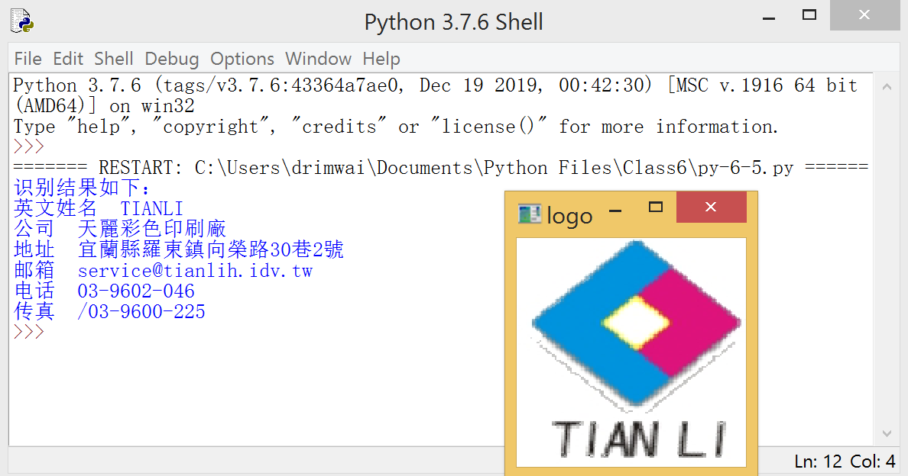

<center>图6-6-2 名片识别效果</center>

- 习题

1. 如何实现对一张包含多张名片的图像进行名片识别？
2. 名片识别可以用在什么场景，如何进行对应的创新应用设计与代码实现？


### 6.7. 上位机开发

- 知识准备

​    在许多传统行业，例如交通、安防、制造业，往往需要跟设备打交道，有或者新兴行业的新技术需要进行测试，这都需要使用上位机。开发好的上位机可供测试人员测试新的技术，或设备使用人员对相关设备发送参数进行调试。上位机是一个桌面版软件，需要包含按钮、下拉框、文本框、菜单、参数配置以及日志等功能。

- 本节任务

​    tkinter是一个常用的开发桌面版软件的Python库。本节的主要任务是安装tkinter后，利用tkinter库工具搭建优图SDK接口测试上位机，该上位机的功能包括：可选择对应的识别功能接口、可选择目标图像、可打印记录日志以及可显示识别结果。

- 代码

```python
from tkinter import *
from tkinter import filedialog
from tkinter import ttk
from tkinter import scrolledtext
import os
import numpy as np
import cv2 as cv
import time
import TencentYoutuyun
#提供接口必要信息
appid = '10216798'
secret_id = 'AKIDFZifnlK9btzGLDPZ1QTM3Y3RhlcJ78JI'
secret_key = 'yYwDKFyCtQQFsLbgZGm68zgBUbWGtKYe'
userid = 'xxxxxx'
end_point = TencentYoutuyun.conf.API_YOUTU_END_POINT
youtu = TencentYoutuyun.YouTu(appid, secret_id, secret_key, userid, end_point)
session_id = ''
#定义需要用到的函数
#定义点击函数
def clicked():
  file_roots = filedialog.askopenfilenames(initialdir = os.path.dirname(__file__))
  global img_fp
  img_fp = file_roots[0]
  print(img_fp)
  img = cv.imread(img_fp, 1)
  cv.imshow('image', img)
  logText = time.strftime('%Y-%m-%d %H:%M:%S', time.localtime()) + '已选择' + img_fp + '图像\n'
  scr.insert(END, logText)
  #默认显示
  if com.current() == 0:
    logText = time.strftime('%Y-%m-%d %H:%M:%S', time.localtime()) + '未选择接口\n'
    scr.insert(END, logText)
  #图像内容识别功能
  if com.current() == 1:
    ret = youtu.imagetag(img_fp, data_type = 0, seq = '')
    logText = time.strftime('%Y-%m-%d %H:%M:%S', time.localtime()) + '调用接口返回' + str(ret) + '\n'
    scr.insert(END, logText)
    text = ''
    for i in range(len(ret['tags'])):
        ret_type = ret['tags'][i]['tag_name'].encode('raw_unicode_escape').decode()
        text += ' ' + 'tag_name = '+ ret_type + '  tag_confidence = ' + str(ret['tags'][i]['tag_confidence'])
    logText = time.strftime('%Y-%m-%d %H:%M:%S', time.localtime()) + '图像识别结果是：' + text + '\n'
    scr.insert(END, logText)
  #手写字体识别功能
  if com.current() == 2:
    handwritingocr = youtu.handwritingocr(img_fp, data_type = 0)
    length = len(handwritingocr['items'])
    text = ''
    for i in range(0, length):
      text += ' ' + handwritingocr['items'][i]['itemstring'].encode('raw_unicode_escape').decode()
    logText = time.strftime('%Y-%m-%d %H:%M:%S', time.localtime()) + '调用接口返回：' + str(handwritingocr) + '\n'
    scr.insert(END, logText)
    logText = time.strftime('%Y-%m-%d %H:%M:%S', time.localtime()) + '手写字符识别结果是：' + text + '\n'
    scr.insert(END, logText)
#定义功能下拉卡函数
def func(event):
  logText = time.strftime('%Y-%m-%d %H:%M:%S', time.localtime()) + '已选择第' + str(com.current()) + com.get() + '功能\n'
  scr.insert(INSERT, logText)
#定义清除函数
def clearlog():
  scr.delete(1.0, END)
#初始化用户UI窗口
#初始化窗口
window = Tk()
window.title('Youtu SDK桌面测试软件')
window.geometry('600x300')
#初始化下拉控件
select_api = StringVar()
com = ttk.Combobox(window, textvariable = select_api)
com.grid(column = 1, row = 1)
#设置下拉控件数据
com['value'] = ('请选择优图SDK AI功能', '图像内容识别', '通用手写文字识别')
com.current(0)
#下拉控件绑带函数
com.bind('<<ComboboxSelected>>', func)
#初始化清除按钮
btn_clear = Button(window, text = '清空日志', command = clearlog)
btn_clear.grid(column = 2, row = 1)
#初始化图像识别按钮
btn_select = Button(window, text = '选择需要识别的图像', command = clicked)
btn_select.grid(column = 3, row = 1)
#初始化可滚动的文本控件
scr = scrolledtext.ScrolledText(window, width = 60, height = 9, font = ('Times', 12))
scr.place(x = 50, y = 50)
logText = time.strftime('%Y-%m-%d %H:%M:%S', time.localtime()) + '软件启动\n'
scr.insert(END, logText)
#显示用户UI窗口
window.mainloop()
```

- 执行效果

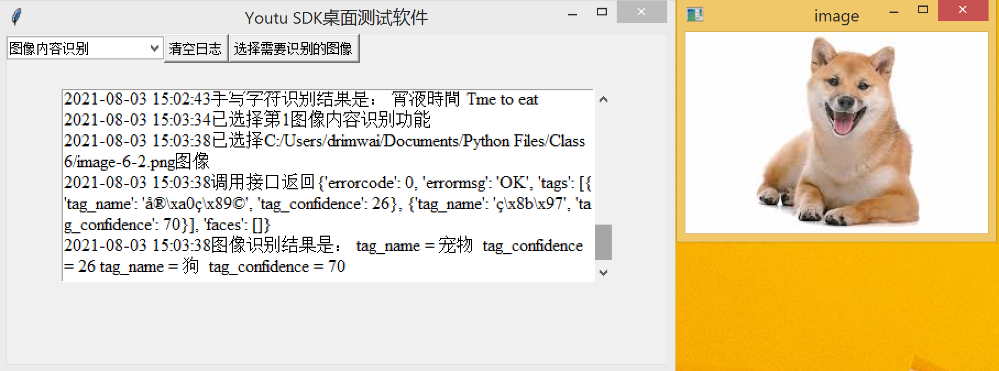

<center>图6-7-1 上位机执行效果</center>

- 习题

1. 什么是上位机？

    在许多传统行业，例如交通、安防、制造业，往往需要跟设备打交道，有或者新兴行业的新技术需要进行测试，这都需要使用上位机。开发好的上位机可供测试人员测试新的技术，或设备使用人员对相关设备发送参数进行调试。上位机是一个桌面版软件，需要包含按钮、下拉框、文本框、菜单、参数配置以及日志等功能。

2. 如何创建下拉框，并绑定事件？

   ```
   #初始化下拉控件
   select_api = StringVar()
   com = ttk.Combobox(window, textvariable = select_api)
   com.grid(column = 1, row = 1)
   #设置下拉控件数据
   com['value'] = ('请选择优图SDK AI功能', '图像内容识别', '通用手写文字识别','手势识别功能')
   com.current(0)
   #下拉控件绑带函数
   com.bind('<<ComboboxSelected>>', func)
   ```

3. 如何创建按钮，并绑定事件？

   ```
   #初始化清除按钮,其中command=clearlog绑定事件
   btn_clear = Button(window, text = '清空日志', command = clearlog)
   
   ```

4. 如何创建滚动文本框，并绑定事件？

5. 如何向滚动文本框里写入数据和清除数据？

6. 如何在事件中调用机器视觉云端接口，实现识别功能？

7. 如何选取需要识别的图像并获取图像的地址？

8. 设计一个创新小应用，在上位机代码中调用摄像头获取图像帧，并调用机器视觉云端接口实现实时识别并保存结果。
